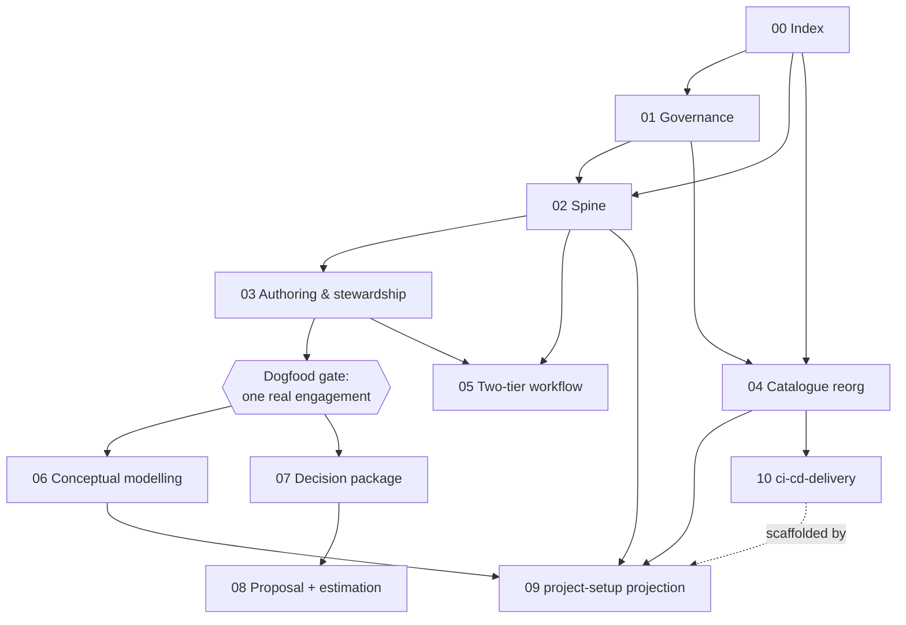

# EPIC-00: Skillery v2 — Master Index & Sequencing

## 0. Original brief (context — verbatim intent)

Strengthen this repository by integrating the results of two research syntheses:

- `RESEARCH-ai-coding-workflow-synthesis.md` — the **build-tier** zoom-in (the Epic
  lifecycle: shape → spec densification → clarity gate → BDD → TDD → review → docs → deliver).
- `RESEARCH-skillery-v2-product-development-system.md` — the **master frame**: evolve
  `skillery` from a skills catalogue into a full product-development operating system spanning
  consulting → delivery, connected by a durable specification spine.

Also: properly initialise `AGENTS.md` as this repo's operating manual, **ban `CLAUDE.md`** in
favour of `AGENTS.md`, and decide the fate of `tests/`, `tools/`, `template/`, `spec/`, and
`scripts/init-meaningfy-project.sh`.

This file is the index for the EPIC series that delivers that integration. It records the
governing thought, the decisions taken during deliberation, the dependency graph, the build
order, and the risk register. The per-workstream EPICs are `EPIC-01` … `EPIC-09`.

---

## 1. Governing thought

> **skillery is the operating system; project repos are instances.**

Every change is either (a) a change to *skillery itself* — its structure, governance, catalogue,
method docs, and skills — or (b) a change to *what skillery projects* into a client/product repo
(the `project-setup` output with the spine instantiated). Research B is the master frame; Research
A is the build-tier detail nested inside it (Research B's phases P4–P5).

**Reliable product development is the thread, not the island count.** The keystone deliverable of
this series is the *connective tissue* — a durable, traceable specification spine (OpenSpec) — not
more skills. New skills are extracted *after* the spine is proven on one real engagement.

---

## 2. The two tiers and the two repos

```
PROJECT / ENGAGEMENT TIER (upfront, human-led, per project)
  Orientation → Proposal/SoW → Decision Package → Architecture (+ Conceptual Model)
  → Work breakdown into shaped Epics → Project & repo setup

EPIC / BUILD TIER (repeated, one Epic at a time — Research A)
  Shape the Epic (EPIC = work shape = OpenSpec change proposal)
  → derive PLAN (clarity-gated ≥9/10 = tasks.md)
  → Gherkin features + test data
  → implement (TDD; generate-verify-integrate; Cosmic Python layers)
  → review (agent + peer + human) → documentation → Epic delivered
```

The commercial/PM wrapper (tendering, client acceptance, invoicing, redelivery, sprint cadence)
stays at the higher tier and is **out of scope** for these EPICs (Research A D3).

---

## 3. Decisions register (locked during deliberation)

| # | Decision | Rationale |
|---|----------|-----------|
| **DEC-1** | **Full vision, sequenced.** Adopt Research B as the master frame with Research A as the build-tier detail; produce a complete EPIC set but land it in the build order below (spine + foundations first), never big-bang. | Reliability is the thread proven incrementally, not catalogue breadth. |
| **DEC-2** | **Full OpenSpec adoption** via a **forked `meaningfy` schema**, `/opsx:*` commands, and `openspec validate --strict` in CI. OpenSpec is the artifact-lifecycle engine; Meaningfy skills do elicitation, semantic clarity, BDD, and TDD execution. Also define Meaningfy-specific OpenSpec **workflows/profiles** (combos of `/opsx` commands). **Amended by Q2.2=B (EPIC-02):** the fork keeps OpenSpec's **native artifact files** and overlays the Meaningfy vocabulary — **EPIC ≡ `proposal.md`** (Shape-Up shape), **PLAN ≡ `design.md` + `tasks.md`** (the pair the clarity gate scores; not a single merged `PLAN.md` file), normative requirements ≡ `specs/` deltas. The fork is **thin** (Q2.1=A): only the EPIC/PLAN templates + 3 hard rules; rich per-artifact `rules:` deferred until the dogfood gate. Per-artifact `rules:` live in `openspec/config.yaml` (not in `schema.yaml`). | OpenSpec's schema-fork model bends the framework to our artifacts; staying on native filenames is the truest "stick to OpenSpec conventions" and avoids fighting the tooling. |
| **DEC-3** | **Split-by-churn documentation.** Markdown for high-churn agent-loop artifacts (EPIC, PLAN, specs, task logs, `.claude/`); AsciiDoc/Antora for durable published canon (architecture, ADRs, requirements, user docs). | OpenSpec and assistants are Markdown-native; Antora suits the durable canon. |
| **DEC-4** | **`CLAUDE.md` is the canonical agentic file** (Claude Code loads `CLAUDE.md`, **not** `AGENTS.md` — confirmed). Offer `AGENTS.md` as an optional **symlink → `CLAUDE.md`** for AGENTS-reading tools (Codex, etc.). Applied everywhere (this repo, templates, `project-setup` output). *(Amended from the earlier "AGENTS.md only" after confirming the harness does not load `AGENTS.md`.)* | One governing file, no duplicate-drift, and it actually loads. |
| **DEC-5** | **Delete `scripts/init-meaningfy-project.sh`; fold into `project-setup`.** One projection path (greenfield + brownfield), extended with `openspec/` wiring. | Removes the script↔skill drift. |
| **DEC-6** | **Nest `skills/` into phase subfolders + re-cut the marketplace into 7 bundles total** (6 phase bundles — consulting, communication, modelling, architecture, engineering, ai-coding — + a `meaningfy-spine` meta-bundle). | Legible mapping from catalogue to the workflow. |
| **DEC-7** | **Deliverable = per-workstream EPICs + this master index.** PLANs derived later, per-EPIC, when each is picked up. | YAGNI; avoid front-loading planning before an EPIC is chosen. |
| **DEC-8** | **Drop the EARS layer** (Research A). Use OpenSpec's native RFC-2119 `SHALL` + Given/When/Then for normative requirements in `specs/`, and real `.feature` files (bdd-gherkin) for executable acceptance. | EARS would be a third redundant notation; OpenSpec already carries the normative layer. |
| **DEC-9** | ~~Spec stewardship folds into `epic-planning`~~ **Amended by Q3.1=C (EPIC-03): stewardship is its own skill.** Boundary precision wins over leanness — `epic-planning` owns **authoring** (seed→EPIC→PLAN→gate); the new **`spec-stewardship`** skill owns the **living-spec lifecycle** (archive, delta→`specs/` merge, grooming, orientation-index policy). Two guarded skills with limited responsibilities, not one massive one. `/opsx:archive` + the spine docs remain the mechanics both skills point to. | Per the user's standing preference: better to split into 2–3 focused skills with clean lifecycles than keep one overloaded skill. |
| **DEC-10** | **Conceptual Model: in-project `model/` by default**, broad skill scope (default LinkML, but model2owl/ontology tooling too; URIs + ontology-engineering best practices; generate Python/TS/JSON-schema/DB-schema + OWL/SHACL; custom generators; Mermaid; terminology/disambiguation/definitions management). **Conditional: product-development projects only.** | CM is central to Meaningfy but not every repo is a product repo. |
| **DEC-11** | **Keep `decision-package`**, sequenced in the consulting tier (after the spine + build-tier foundations). | Revenue-relevant front-of-funnel, but not on the dogfood critical path. |
| **DEC-12** | **Installation instructions must explicitly separate user-level vs project-level.** For both **skills/plugins** (installed once at the user/machine level vs pinned per project) and **`CLAUDE.md` content** (global `~/.claude/CLAUDE.md` vs the repo `./CLAUDE.md`): say what goes where and why. | A new employee must know exactly what to install once vs per-repo. Owned by EPIC-04 (docs) + EPIC-01 (constitution chain). |
| **DEC-13** | **CI/CD & release is in scope as an *engineering* capability** (EPIC-10): the **application-repo side** (build/test/release, versioned image, deploy-trigger contract). **VM provisioning** (`cloud-infrastructure`, Terraform+Ansible) and **stack hosting** (`infrastructure-stacks`) stay **DevOps-owned and out of the skill's automation scope** — documented as boundaries only. *(Clarifies the Research-A D3 tension: D3 scoped client redelivery/acceptance out; app-repo CD is a build-team engineering concern and is in.)* | The user asked for CD; the decoupled Meaningfy model already exists — the gap is the unstandardised app-repo side, not provisioning. |

### Research open-decisions, now resolved

- Research A #1 (doc format) → **DEC-3**.
- Research A #2 (memory/spec home) → durable truth lives in OpenSpec `specs/`; `.claude/memory` is a
  regenerable working index (**EPIC-02**, **EPIC-03**).
- Research B #1 (one repo from P1 vs separate engagement repo) → **one repo from P1** so the golden
  thread is unbroken (revisit per engagement in **EPIC-07/09**).
- Research B #2 (conceptual-modelling as its own skill) → **yes, own skill** (**EPIC-06**, **DEC-10**).
- Research B #3 (EPIC↔OpenSpec change mapping) → `EPIC.md` ≈ change `proposal.md`; `PLAN.md` ≈
  `tasks.md (+ design.md)`; durable `specs/` is net-new (**EPIC-02**).
- Research B #4 (P1 deliverable naming) → settle inside **EPIC-07**.
- Research B #5 (where stage gates are enforced) → settle inside **EPIC-08** (CI + checklist + sign-off).

---

## 4. The YAGNI documentation/spec ladder

Necessary **and** sufficient; nothing duplicated. (Detailed in EPIC-02/03/05.)

| Level | Artifact | Home | Lifecycle |
|---|---|---|---|
| 0 | **Seed inputs** (human briefs, notes, codebase analysis) | `changes/<id>/inputs/` | raw, archived, **never deleted/groomed**; the EPIC supersedes them |
| 1 | **Architecture** + ADRs + contracts | `docs/` (AsciiDoc/Antora) | durable; depth scales down for non-product repos |
| 1b | **Conceptual Model** *(conditional)* | `model/` (in-project default) | living, regenerates artefacts deterministically |
| 2 | **EPIC = work shape = OpenSpec `proposal.md`** | `openspec/changes/<id>/` | groomed; spec deltas merge to `specs/` on archive |
| 3 | **PLAN = `design.md` + `tasks.md`** (the native pair), clarity-gated ≥9/10 | `openspec/changes/<id>/` | derived from the EPIC; the clarity gate scores the pair (Q2.2=B) |
| 4 | **Gherkin `.feature`** + spec-delta Given/When/Then | `tests/features/` + change `specs/` | executable acceptance |
| 5 | **Living `specs/`** (capability contracts) | `openspec/specs/` | the preserved, machine-validated truth |

---

## 5. EPIC catalogue & dependency graph

| EPIC | Title | Tier | Depends on |
|---|---|---|---|
| [01](EPIC-01-repo-governance.md) | Repo governance & self-alignment | foundation | — |
| [02](EPIC-02-spine-openspec.md) | The Spine (OpenSpec `meaningfy` schema + golden thread) | foundation | 01 (doc standard, CLAUDE-canonical) |
| [03](EPIC-03-spec-authoring-stewardship.md) | Spec authoring & stewardship (`epic-planning` enrichment) | foundation | 02 |
| [04](EPIC-04-catalogue-reorg-bundles.md) | Catalogue reorg & bundle re-cut | foundation | 01 |
| [05](EPIC-05-two-tier-workflow-guardrails.md) | Two-tier AI-coding workflow & guardrails | method | 02, 03 |
| [06](EPIC-06-conceptual-modelling-skill.md) | `conceptual-modelling` skill | new skill | 02, 04, DOG-GATE |
| [07](EPIC-07-decision-package-skill.md) | `decision-package` skill | new skill | 04, DOG-GATE |
| [08](EPIC-08-proposal-estimation-engagement.md) | `proposal-writing` + `estimation` + engagement docs | new skill | 07 |
| [09](EPIC-09-project-setup-projection.md) | `project-setup` rework: projection with spine pre-wired | projection | 01, 02, 04, 06 |
| [10](EPIC-10-ci-cd-delivery-skill.md) | `ci-cd-delivery` skill (CI/CD & release) | new skill | 04 (relates to 05, 09) |

> **DOG-GATE** = the dogfood gate (§6): run one real engagement end-to-end through the spine before
> extracting the new skills. Not an EPIC file — a validation milestone in a separate engagement repo.



---

## 6. Build order & the dogfood gate

1. **Foundations** — EPIC-01, EPIC-02, EPIC-04 (largely parallel), then EPIC-03 (needs the schema).
2. **Dogfood gate** — run **one real engagement end-to-end** through the spine (ideally a small
   fixed-cost one). Let that project tell you what the schema, the golden-thread IDs, and the
   `decision-package` must carry *before* hardening them. This is a validation milestone, not an
   EPIC file (it is project work in a separate repo).
3. **Method + extraction** — EPIC-05 (workflow docs), then EPIC-06 and EPIC-07 extracted from what
   the dogfood taught.
4. **Consulting completion** — EPIC-08.
5. **Engineering CD** — EPIC-10 (`ci-cd-delivery`), reviewed with DevOps; not dogfood-gated (it
   codifies existing infra), but its templates feed EPIC-09, so land it before/with projection.
6. **Projection** — EPIC-09 last, so `project-setup` scaffolds a spine (and the EPIC-10 deploy/release
   workflows) whose shape has stabilised.

---

## 7. Risk register

| # | Risk | Mitigation |
|---|------|------------|
| **RISK-1** | **Resolved.** Confirmed Claude Code loads `CLAUDE.md`, **not** `AGENTS.md`. → DEC-4 amended: `CLAUDE.md` is canonical; `AGENTS.md` is an optional symlink → `CLAUDE.md`. No instruction loss. | Closed; the EPICs apply DEC-4 directly (no verify-then-delete dance). |
| **RISK-2** | **Building all skills at once** → a beautiful framework never validated. | DEC-1 build order + the dogfood gate; extract `decision-package`/`conceptual-modelling` only after one real run. |
| **RISK-3** | **Custom-schema maintenance cost.** A forked OpenSpec schema must track upstream OpenSpec changes. | Pin the OpenSpec version; `schema validate` in CI; fallback is to lift only `specs/`+`archive`+`validate` conventions by hand (recorded in EPIC-02). |
| **RISK-4** | **OpenSpec drift vs Meaningfy artifacts.** `/opsx` planning (`tasks.md`) overlaps PLAN/`writing-plans`; OpenSpec Given/When/Then overlaps `bdd-gherkin`. | EPIC-05 documents the single-owner resolutions (DEC-8); the validator (EPIC-04) checks no artifact is authored twice. |
| **RISK-5** | **Two constitutions drifting** (global `CLAUDE.md` vs `openspec/project.md` vs engineering-standards). | EPIC-01 one-constitution reconciliation: one governing source, others point to it. |
| **RISK-6** | **Frozen-content edits.** `executive-communication`, `semantic-consulting-coach`, `docs/ai-coding/` carry frozen content from the prior reorg. | EPIC-04/05 relocate, never rewrite, frozen content unless an EPIC explicitly supersedes it (EPIC-05 supersedes the `docs/ai-coding/` methodology — note this break explicitly). |

---

## 8. Acceptance for the series

- **A0.1** Every EPIC-01…09 follows the house style (shaped bet · requirements · constraints ·
  acceptance · added/changed/deleted) and cross-references its dependencies.
- **A0.2** The decisions register (§3) is the single source for cross-EPIC decisions; no EPIC
  re-litigates a locked decision without amending this file.
- **A0.3** `make validate` passes after every EPIC lands (the repo never spends a merge in a
  self-inconsistent state).
- **A0.4** The dogfood gate is recorded (link to the engagement repo) before EPIC-06/07 begin.
- **A0.5** No consumer-facing doc in the ripple matrix (§9) is left describing the *old* model
  after its owning EPIC lands; `make validate` link/inventory checks pass.

---

## 9. Cross-cutting: documentation & guideline ripple

These changes touch far more than the skills themselves — every onboarding, installation, method,
and how-to-use document must move in lockstep or it will describe a system that no longer exists.
This matrix is the **single traceability list**: each consumer doc names the EPIC that updates it
and what changes. No EPIC is "done" until its ripple rows are addressed. (Cross-cutting requirement
**R-DOCS** is restated in each owning EPIC.)

| Consumer doc | Owning EPIC | What must change |
|---|---|---|
| `README.md` (front door, install, structure, catalogue table) | **04** | new bundle structure (7 + spine), skill subfolders, **CLAUDE.md-canonical (+ optional AGENTS symlink)**, **user-vs-project install levels (DEC-12)**, OpenSpec mention, projection via `project-setup` only |
| `docs/environment-setup.md` (install + external deps + projection) | **04** (install/bundles), **02** (OpenSpec dependency), **09** (projection path) | add OpenSpec install + `/opsx`; drop the init-script path; re-cut bundle install commands; **user-level vs project-level split for skills + `CLAUDE.md` content (DEC-12)**; CLAUDE.md-canonical note |
| `docs/ai-coding/ai-coding-methodology.md` | **05** | two-tier model; EPIC=proposal / PLAN=tasks; drop EARS; OpenSpec/stream-coding/superpowers composition; guardrails |
| `docs/ai-coding/ai-coding-runbook.md` | **05** | day-to-day `/opsx` workflow; seed→EPIC→PLAN authoring; agent roster reconciliation |
| `docs/ai-coding/ai-coding-setup-guide.md` | **05** (method), **09** (scaffold) | `openspec/` layout, `.claude/` + memory-as-index, the canonical `CLAUDE.md` |
| `docs/ai-coding/dod-quality-gates.md` | **05** (build gates), **08** (engagement gates upward) | `validate --strict` + clarity-gate split; engagement-level stage gates |
| `docs/engineering-standards/testing-standard.md` (new) | **05** | consolidating testing canon (taxonomy + per-type rulesets + data/conftest conventions + tools) that narrates & points to `project-setup`/`cosmic-python`/`bdd-gherkin` |
| CI/CD external boundary in `docs/environment-setup.md` + the "Epic delivered" step | **10** | the `cloud-infrastructure` / `infrastructure-stacks` / Vaultwarden / bastion boundary; app-repo build/release/deploy-trigger; CI(project-setup) vs CD(ci-cd-delivery) split |
| `CONTRIBUTING.md` + `spec/CREATING_SKILLS.md` | **01** (template/→spec/), **04** (subfolders) | authoring home, where new skills live, bundle assignment |
| `project-setup` skill (`SKILL.md` + references) | **09** | scaffold `openspec/` + schema pin + `/opsx` + conditional `model/` + CLAUDE-canonical (+ optional AGENTS symlink) + global/repo CLAUDE split + split-by-churn docs + CI gates |
| `prompts/` templates | **01** | collapse to a single canonical `CLAUDE.md.template` (+ optional AGENTS symlink); route to OpenSpec + the spine |
| `agents/` thin wrappers (`epic-planner`, `implementer`, `code-reviewer`) | **03** (planner), **05** (roster) | wire to `/opsx` + enriched skills |
| The validator (`tools/repo_lint` + `tests/`) | **04** | check subfolders, 7 bundles, CLAUDE.md-canonical (AGENTS.md, if present, is a symlink), no orphan init-script refs, spine presence |
| Global coding prompt (`~/.claude/CLAUDE.md` ≡ engineering-standards) | **01** | one-constitution reconciliation |
