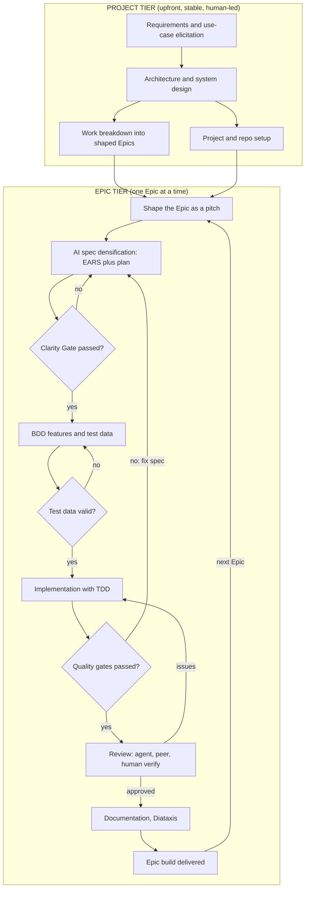

# AI-Assisted Coding Workflow: Synthesis

**Status:** working synthesis for review. Consolidates the design discussion (Miro
diagram review, colleague feedback, alignment to the Shape Up and company process,
and the four spec/cadence/scope/documentation decisions).

**Governing thought:** the AI-coding practice is the *build-tier zoom-in* of
Meaningfy's Epic lifecycle. A human shapes each Epic as a rough pitch; agents
densify that pitch into EARS-plus-Gherkin specs and build it one Epic at a time
under explicit quality gates; and every spec, plan and log lives in the repository
as the single source of truth. The commercial and PM wrapper (tendering, client
acceptance, invoicing, redelivery, sprint cadence) stays at the higher tier and
off this canvas.

---

## 1. Decisions taken in this thread

| # | Topic | Decision |
|---|-------|----------|
| D1 | Spec densification | Human writes the Shape Up pitch; an agent densifies it into normative requirements (EARS), a plan, and acceptance scenarios (Gherkin). Modelled on OpenSpec (proposal then specs, design, tasks). |
| D2 | Ordering and cadence | Architecture is produced **first** and kept stable; it is the source for breaking work into Epics. Then build **one Epic at a time**. Sprint cadence is out of scope here. This settles the earlier "shape-first" question: the wholesale reorder is **not** applied; the workflow is two nested tiers. |
| D3 | Scope | Cover **Building and build-team shipping only**, from the delivery crew's point of view (developers, testers, technical writers, data engineers). One technical acceptance gate; no client acceptance, invoicing or redelivery on this canvas. |
| D4 | Documentation home | Architecture and all AI-loop artefacts (Epic work shapes, specs, plans, task descriptions, logs, user docs) live **in the repository under `/docs`**. Rule: if an agent reads or writes it, it lives in the repo. `.claude/memory` becomes a regenerable index, not truth. |

**Deliberate divergence to label on the diagram:** front-loading a stable
architecture is contrary to canonical Shape Up (which avoids big upfront design).
It is a chosen, defensible divergence for semantic and knowledge-graph work, where
the conceptual model must stabilise before sensible Epics can be carved.

---

## 2. The projected workflow

The golden rule runs throughout the Epic tier: when a test fails by design, fix
the spec and regenerate, never patch the generated code in place.

---

## 3. Inventory per phase

### Project tier

| Phase | Owner | Inputs | Skills and tools | Outputs | Gate |
|-------|-------|--------|------------------|---------|------|
| **P1. Requirements and use-case elicitation** | Analyst / Shaper, agent-assisted (Opus) | Business context, stakeholder input, existing corpus (brownfield), Project Charter from the higher tier | Agentic requirements and scenario generation skill; **SEED** (LLM plus behaviour ontology, surfaces uncommon and edge-case interaction scenarios); **AgOCQs++** (competency questions from a corpus, scopes the ontology) | Requirements, use cases, competency questions, scenario set including edge cases | Human sign-off on scope |
| **P2. Architecture and system design** | Architect, agent-assisted (Opus) | Requirements, use cases, competency questions, reference and sample data | `architecture` skill, `cosmic-python` skill, ADR template, conceptual-data-model and ontology tooling | Stable architecture document (AsciiDoc in `/docs`), system and conceptual data models, ADRs (including the guardrails ADR) | Architecture review; stable before breakdown |
| **P3. Work breakdown into shaped Epics** | Shaper | Architecture document | Work-shape and pitch writing skill; Shape Up shaping (rough, solved, bounded; appetite in weeks) | Epic list, each with a pitch and an appetite | Shaped means rough, solved, bounded |
| **P4. Project and repo setup** (parallel) | Developer, agent-assisted | Architecture, tech-stack decisions (Stream Coding blueprint) | Project repository scaffold skill; CI/CD skill (Make, Docker, Compose, GitHub Actions, K8s, Terraform, Vault); README standard; `cosmic-python`; architectural guardrails (import-linter everywhere, CodeQL for critical repos); GitNexus; Context7 | Scaffolded repo in Cosmic Python layers; `CLAUDE.md`, agents, skills, `.mcp.json`, memory dir, `Makefile`, CI/CD config, compliant README, import-linter contracts | Scaffold verified (`/agents`, `/skills`) |

### Epic tier (repeated per Epic)

| Phase | Owner | Inputs | Skills and tools | Outputs | Gate | Model |
|-------|-------|--------|------------------|---------|------|-------|
| **E1. Shape the Epic** | Shaper (human) | Epic slot from breakdown, appetite | Work-shape and pitch writing; Shape Up Phase I and II; optional SEED for edge cases | Epic pitch (the OpenSpec *proposal*), in `/docs` | Pitch reviewed by the team | n/a |
| **E2. AI spec densification** | `epic-planner` agent, human review | Epic pitch, architecture, project context, reference data | `epic-planning` skill; Stream Coding Phase 2; **EARS** (normative requirements); OpenSpec layout (proposal then specs, design, tasks); `clarity-gate` skill | `EPIC.md`: EARS requirements plus design and plan plus task breakdown, in `/docs` | **Clarity Gate** scores 9 of 10 or higher (pre-code review plus strict validation of missing scenarios) | Opus |
| **E3. BDD features and test data** | `gherkin-writer` agent, human checks business accuracy | `EPIC.md`, EARS requirements, optional reference and sample data | Gherkin feature writing skill; test data generation skill; SEED edge cases feed here | Gherkin `.feature` files; synthetic and sample test data | Optional **test-data validation** gate (verify agent-produced data, especially when little sample data was given) | Sonnet |
| **E4. Implementation (TDD)** | `implementer` agent, human owns the code and signs the PR | A single Task plus its Gherkin features | Stream Coding Phase 3 (generate, verify, integrate); `superpowers` test-driven-development, systematic-debugging, verification-before-completion; `cosmic-python`; GitNexus impact analysis before edits; `commit-commands`; Context7 | Production code, tests and step definitions in the correct layers; task file and implementation log in `/docs` | Tests green; coverage 80% or higher; architecture check (import-linter, `make check-architecture`). Fix the spec, not the code | Sonnet |
| **E5. Review and acceptance** | `code-reviewer` agent (read-only), peer reviewer, human verifier | Staged changes | `meaningfy-code-review` skill; external `code-review` plugin; GitNexus changed-symbol impact; import-linter; CodeQL (critical repos) | Review feedback or approval; peer review (four-eyes); optional human verification (for example manual REST API scenarios); commit and PR | No open Critical findings; Definition of Done met | Opus |
| **E6. Documentation** | `documenter` agent, human | Shipped Epic, code, specs | User documentation skill (Diataxis: tutorial, how-to, reference, explanation); `clarity-gate` (light); COMPOSE method; Clean Design Documentation Principles | Diataxis docs, updated README, architecture docs (AsciiDoc in `/docs`); `MEMORY.md` index refreshed | Documentation clarity check | Haiku |
| **E7. Epic build delivered** | Build team | Completed Epic | `meaningfy-git-workflow` | Code, tests, docs and **data artefacts (including RDF and graph data)**, ready for handoff to the higher tier | Single technical acceptance gate; redelivery decision happens off-canvas | n/a |

---

## 4. Master inventory of assisting tools and skills

**Agents (the runbook roster).** `epic-planner` (Opus), `gherkin-writer` (Sonnet),
`implementer` (Sonnet), `code-reviewer` (Opus), `documenter` (Haiku). Sub-agents
cannot nest; skills listed in their frontmatter are injected into context.

**Meaningfy skills (knowledge and methodology).** `stream-coding`, `clarity-gate`,
`cosmic-python`, `architecture`, work-shape / pitch writing, `epic-planning`,
Gherkin feature writing, test data generation, user documentation (Diataxis),
`meaningfy-code-review`, `meaningfy-git-workflow`, project scaffold, CI/CD,
agentic requirements and scenario generation.

**External plugins and skills.** `superpowers` (test-driven-development,
systematic-debugging, verification-before-completion, brainstorming),
`commit-commands`, `code-review`.

**MCP servers and tools.** GitNexus (impact and blast-radius analysis before and
during edits), Context7 (up-to-date library documentation).

**Formalisms and standards.** EARS (five requirement patterns: ubiquitous,
event `WHEN`, state `WHILE`, unwanted `IF/THEN`, optional `WHERE`); Gherkin / BDD;
OpenSpec (proposal then specs, design, tasks; living spec versus per-change delta);
Cosmic Python layering (`entrypoints` to `services` to `models`, `adapters` to
`models`); import-linter and CodeQL; Diataxis; the README standard; COMPOSE;
Clean Design Documentation Principles; Conventional Commits; GitFlow.

**Models.** Opus for planning, analysis and review; Sonnet for implementation and
BDD; Haiku for documentation and summaries.

**Use the layers, do not double-spec.** EARS carries the normative and
non-functional "shall" statements; Gherkin carries behavioural acceptance; the
plan (OpenSpec design and tasks) carries sequencing. Do not write both EARS and
Gherkin for the same behaviour.

---

## 5. Cross-cutting concerns

- **Guardrails (apply to every agentic step).** Decision bounds, output
  validation, and prompt-injection defence. Represent as a band behind the
  agentic phases plus a legend entry, not as a single node. These validate agent
  *behaviour*; the Clarity Gate, tests and review validate *content*.
- **Single source of truth.** OpenSpec model: specs live in the repo and persist
  across sessions. `/docs` holds the canonical, reviewable, versioned artefacts;
  `.claude/memory/MEMORY.md` is a regenerable working index. Confluence keeps only
  higher-tier PM and commercial artefacts.
- **Memory conventions.** `MEMORY.md` capped at about 200 lines; per-Epic and
  per-task files carry specification plus implementation log; agents load only the
  relevant Epic folder.
- **Quality gates.** Clarity Gate, tests green plus coverage, architecture check,
  code review, Definition of Done.
- **Definition of the agent (Alex).** An agent is an LLM with specific
  instructions and access to data and tools, operating under guardrails. Pin this
  in the legend.

---

## 6. Open decisions to settle before the repo work

1. **Documentation format (unresolved, blocks repo work).** Markdown for the
   high-churn agent-authored artefacts (specs, plans, task logs) versus AsciiDoc
   for durable architecture and published docs, or AsciiDoc everywhere.
   Recommendation: split by churn and audience (Markdown for the agent loop,
   AsciiDoc for the canon), since OpenSpec and most assistants are Markdown-native.
2. **Memory and spec home.** Confirm `/docs` as canon and `.claude/memory` as
   cache, superseding the runbook's `.claude/memory/epics` placement for the
   durable artefacts.
3. **Diagram edits still to apply** (build-tier subset of the colleague feedback):
   guardrails band and legend; agentic requirements skill at P1; sample-data input
   and validation gate at E3; peer review and human verification at E5; the
   greenfield and scope note. Off-canvas (higher tier): client acceptance,
   invoicing, redelivery.

---

## 7. How this nests in the higher-tier company process

| Company process (2-year-old BPMN) | Covered here |
|-----------------------------------|--------------|
| Tendering, contract, kick-off, Project Charter, WBS | No (higher tier) |
| Per-Epic: Epic Shaping | P3 and E1 |
| Per-Epic: Epic Building | E2 to E6 |
| Per-Epic: Epic Shipping (build team) | E7 |
| Epic Acceptance and Invoicing, client demo, redelivery | No (higher tier) |
| Sprint cadence and rituals | No (the Epic loop runs within sprints; not modelled) |

The workflow is the inside of the company process's *Epic Shaping to Epic Building
to Epic Shipping* band, with declared interfaces: inputs are the Project Charter
and the architecture; the output is a delivered Epic build ready for the higher
tier to take to the client.

---

## 8. Sources reflected

Meaningfy AI-coding docs (runbook, setup guide, DoD and quality gates,
architectural guardrails, git and collaboration, project structure, strategic
blueprint, stream-coding notes, the art of coding with an LLM); company process
docs (Agile project execution, how to shape up, project shipping, redelivery
policy, BPMN workflow, documentation management, README standard); the two papers
on agentic requirements and competency-question generation (SEED; AgOCQs++);
OpenSpec spec-driven development; EARS.
