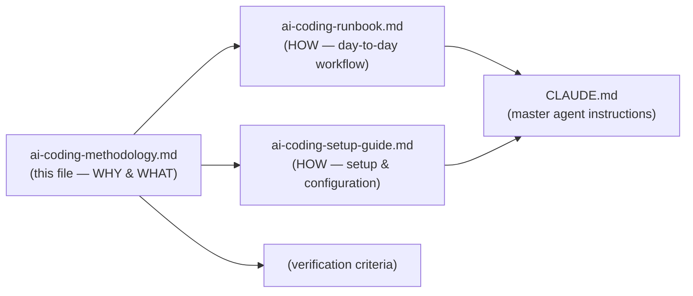

# Meaningfy AI-Assisted Coding Methodology

**Audience:** Developers and technical leads adopting AI-assisted development at Meaningfy.

**Purpose:** This document describes the methodology — the *why* and *what*. For the
operational *how*, see the companion documents:
- [AI Coding Runbook](ai-coding-runbook.md) — day-to-day workflow and agent lifecycle
- [AI Coding Setup Guide](ai-coding-setup-guide.md) — file structure and configuration
- [Definition of Done & Quality Gates](dod-quality-gates.md) — verification criteria

---

## 1. Core Principles

### 1.1 Specification-Driven Development

Code is generated from specifications, not improvised. The flow is always:

```
Architecture Docs + Work Shape + Sample Data
        ↓
    EPIC Specification (implementation-ready)
        ↓
    Gherkin Features + Test Data
        ↓
    Task Implementation (code + tests)
```

Each stage produces artefacts that feed the next. Skipping stages creates
hidden assumptions that compound into defects.

### 1.2 The Rule of Divergence

> Every manual code edit without updating the spec creates Divergence.
> Divergence is technical debt that breaks the stream.

When tests fail due to a design issue, **fix the spec, not the code**. Trivial
bugs (typos, off-by-one) are fixed in code directly; design-level failures
require spec revision and regeneration.

### 1.3 Human Sovereignty

The developer owns the code and all decisions. Agents:
- Never commit without explicit consent.
- Never make assumptions — they ask clarifying questions.
- Present changes for review before any permanent action.
- Signal when work drifts outside the shaped scope.

### 1.4 Vertical Delivery

Work is organised vertically (to deliver end-to-end value), not horizontally.
An EPIC describes an implementation-level slice of a business requirement
(e.g. a White/Blue use case or a larger feature). Tasks break the EPIC into
steps that touch specific architectural layers but always serve the EPIC's
goal.

---

## 2. The Specification Pipeline

### 2.1 Inputs

| Input | Source | Purpose |
|-------|--------|---------|
| **Architecture docs** | Docs repository (Antora/AsciiDoc) | Business and architectural context — not specific enough for direct implementation |
| **Work Shape** | Confluence | Scoped bet: problem boundaries, appetite, constraints, risks, out-of-scope |
| **Sample/test data** | Real examples or fabricated | Concrete inputs and expected outputs for validation |

Architecture docs provide the frame; the Work Shape provides the bet. Neither
is specific enough for implementation — they are *inputs* to the planning stage.

### 2.2 EPIC Specification

The EPIC is the bridge between business intent and executable instructions.
Produced by the `epic-planner` agent (Opus), it contains:

| Section | Purpose |
|---------|---------|
| Description | High-level functionality chunk |
| Glossary | Internal terms and concept definitions for agent use |
| Algorithm / Flow | High-level algorithm with Mermaid diagram |
| Concrete Examples | Real or fabricated inputs → expected outputs |
| Anti-Patterns | Minimum 5 "don't do this / do this instead" entries |
| Test Case Specifications | Minimum 5 entries with input, output, edge cases |
| Error Handling Matrix | Error type, detection, response, fallback |
| Task Breakdown | Ordered tasks with layers, dependencies, acceptance criteria |
| Roadmap | Status-tracked checklist of all tasks |

**Quality gate:** The Clarity Gate (13-item checklist, 6-criterion scoring)
must score >= 9/10 before proceeding. For EPIC specs, the gate is primarily an
**epistemic check** — it verifies that every claim is grounded (not aspirational),
every assumption is made visible, and every requirement is specific enough to
generate unambiguous code. Vague intent that passes a readability check but
hides assumptions is the primary failure mode; the Clarity Gate is designed to
surface it before it reaches the implementer.

### 2.3 Gherkin Features + Test Data

The `gherkin-writer` agent (Sonnet) translates the EPIC into:
- `.feature` files in business language (no implementation details)
- `Scenario Outline` with `Examples:` for data-driven coverage
- Fabricated test data where real examples are insufficient

Features define **what** the system should do in observable, testable terms.
Step definitions are the implementer's responsibility.

### 2.4 Task Implementation

The `implementer` agent (Sonnet) executes one task at a time using the
generate-verify-integrate loop:

1. **Generate** — tests first, then production code (Cosmic Python layering)
2. **Verify** — run tests immediately; distinguish trivial bugs from design failures
3. **Integrate** — present changes, wait for developer consent, commit

Each completed task produces a task outcome file documenting what was achieved.

### 2.5 The Full Formula

```
(a) Architecture Docs + (b) Work Shape + (f') Sample Data
    → (c) EPIC Specification + (e) Gherkin Features + (f'') Test Data
        → (d₁, d₂, d₃, … dₙ) Task Outcomes
```

---

## 3. Agent Architecture

### 3.1 Agents and Their Roles

| Agent | Model | Phase | Responsibility |
|-------|-------|-------|----------------|
| `epic-planner` | Opus | Planning | Translates business requirements into EPIC specs. Asks many questions, makes no assumptions. Runs Clarity Gate. |
| `gherkin-writer` | Sonnet | Specification | Writes Gherkin features and fabricates test data from EPIC specs. |
| `implementer` | Sonnet | Execution | Implements code following stream-coding. Runs tests in a loop until green. |
| `code-reviewer` | Opus | Review | Reviews code for quality, security, architecture conformance. Read-only. |
| `documenter` | Haiku | Support | Generates documentation, explanations, summaries. Fast and cost-effective. |

### 3.2 Model Selection Rationale

| Task Type | Model | Why |
|-----------|-------|-----|
| Planning, analysis, complex specs | **Opus** | Strongest reasoning; worth the cost for strategic work |
| Implementation, BDD features | **Sonnet** | Strong coding; good balance of speed and quality |
| Investigating, summarising, explaining | **Haiku or Sonnet** | Lightweight tasks; escalate to Sonnet for complex explanations |
| Docstrings, routine documentation | **Haiku** | Fast and cheap |
| Pre-PR code review | **Opus** | Thorough analysis requires strongest model |

**General rule:** Use planning mode (`/plan`) before writing to files — it is
cheaper and faster for reasoning-heavy work.

### 3.3 Agent Constraints

- Agents **never commit** without explicit developer consent.
- No `Co-Authored-By` statements in commits unless requested.
- Commit messages are strict, succinct, describe the **final outcome** — not
  the process, not internal memory references.
- Sub-agents **cannot spawn other sub-agents**. The main conversation
  orchestrates multi-agent workflows.

---

## 4. Memory and Knowledge System

### 4.1 Dual Memory Approach

| Type | Location | Loaded | Purpose |
|------|----------|--------|---------|
| **Auto-memory** | `.claude/memory/MEMORY.md` | Every session (first 200 lines) | Stable codebase patterns, conventions, key decisions |
| **Epic/Task memory** | `.claude/memory/epics/<name>/` | On demand (agent reads relevant epic only) | Project progress: specs, plans, outcomes |

### 4.2 Epic/Task Memory Structure

All memory files — `EPIC.md` and task files — follow a **two-part structure**:

```
# Part 1 — Specification
<!-- Written during Phases 1–2. Authoritative. Do not modify during implementation. -->
[spec, plan, acceptance criteria]

---
<!-- implementation-log -->
---

# Part 2 — Implementation Log
<!-- Written and updated by the implementer during Phase 3. -->
[progress, decisions, deviations, commit links]
```

- **Part 1** is frozen once planning is complete. It is the contract the
  implementer works against.
- **Part 2** is a running log written and updated by the implementer as work
  progresses. It records decisions, deviations, and outcomes — not logistics.
- The separator `--- <!-- implementation-log --> ---` is the boundary agents
  use to distinguish spec from execution record.

For the detailed file format and rules, see [AI Coding Runbook §3.2](ai-coding-runbook.md).

### 4.3 Memory Update Triggers

| Event | Action |
|-------|--------|
| Starting work on an epic | Agent reads the relevant `EPIC.md` |
| Completing a task | Agent writes task outcome file, updates EPIC.md roadmap |
| End of significant session | Agent updates `MEMORY.md` with stable patterns |
| Completing an epic | Agent updates EPIC.md status to complete |

---

## 5. Project Conventions

### 5.1 Repository Structure

Every Meaningfy project repository follows this structure for AI coding support:

```
repo-root/
├── CLAUDE.md                              # Master agent instructions (entry point)
├── docs/ai-coding/
│   ├── ai-coding-methodology.md           # This file (methodology overview)
│   ├── ai-coding-runbook.md               # Developer runbook (day-to-day workflow)
│   ├── ai-coding-setup-guide.md           # Setup and configuration guide
│   └── dod-quality-gates.md               # Definition of Done and quality gates
└── .claude/
    ├── agents/                            # Sub-agent definitions (one file each)
    ├── skills/                            # Skills (methodology + quality gates)
    └── memory/
        ├── MEMORY.md                      # Auto-memory index (<= 200 lines)
        └── epics/                         # Epic/task outcome files
```

### 5.2 Two Levels of Instructions

| Level | File | Scope | Contains |
|-------|------|-------|----------|
| **Global** | `~/.claude/CLAUDE.md` | All Meaningfy projects | Clean Code, SOLID, Cosmic Python, testing strategy, tooling |
| **Project** | `./CLAUDE.md` | This repository | Agent behaviour rules, file references, memory conventions, project-specific rules |

Both are loaded into every conversation. The project-level file complements
(not duplicates) the global file.

### 5.3 Skills

Skills provide domain knowledge to agents. They live at
`.claude/skills/<name>/SKILL.md` and are injected into agent context at startup.

| Skill | Purpose | Used by |
|-------|---------|---------|
| `stream-coding` | Documentation-first development methodology (Phases 1-4) | epic-planner (context), implementer (active) |
| `clarity-gate` | Pre-ingestion quality verification for specs and docs | epic-planner (full gate), documenter (lightweight check) |

**Rule of thumb:** Skills provide *knowledge*; agents perform *action*.

### 5.4 Commits and PRs

Commits are medium-sized, conceptually atomic, and require explicit developer
consent. The implementer uses the `commit-commands:commit` skill for the actual
commit. PR is opened on EPIC completion. Full conventions are in the
[AI Coding Runbook §5](ai-coding-runbook.md).

### 5.5 Recommended Tooling

| Tool | Purpose |
|------|---------|
| `make` targets | Project-specific build, test, lint commands |
| GitNexus | Code intelligence — index repos and expose via MCP for impact analysis |
| Context7 | Up-to-date library documentation via MCP |
| Git worktrees | Parallel development on multiple feature branches |
| `/plan` mode | Cheaper, faster reasoning before writing files |
| `/context` | Monitor token usage during long sessions |
| `claude-md-management` plugin | Audit and improve CLAUDE.md quality |

---

## 6. Development Lifecycle

The lifecycle diagram, phase-by-phase descriptions, and developer vs. agent
responsibilities are in the [AI Coding Runbook](ai-coding-runbook.md). That
document is the operational reference; this file describes the design rationale.

---

## 7. Practitioner Experience Notes

These insights come from team members' experience using AI-assisted development.

### 7.1 What Works Well

- **Roadmap-driven development:** Maintaining a roadmap file that the agent reads
  and writes into. List phases with brief descriptions, expected outcomes, and
  checklists. Dedicated files per phase make it easy to build on previous work.

- **Planning mode first:** Using `/plan` before writing to files is consistently
  cheaper and faster for reasoning-heavy work. Prevents premature code generation.

- **Providing project structure upfront:** Explaining the general structure (ports,
  entrypoints, layers) in the prompt lets the agent generate correct boilerplate
  within the architectural context.

- **Prompt with requirements and intent:** A few paragraphs covering the intended
  behaviour give the agent enough context to produce well-shaped code.

- **Git worktrees for parallel work:** Using git worktrees to maintain separate
  working copies enables concurrent feature development without branch switching.

### 7.2 What Needs Manual Attention

Some things still benefit from manual developer intervention:
- Dependency management (e.g. `pyproject.toml` adjustments)
- Docker and docker-compose configuration tweaks
- Import path corrections
- Minor fixes where the overhead of agent interaction exceeds the fix itself

### 7.3 Model Selection in Practice

See §3.2 Model Selection Rationale for the complete model selection guide.

---

## 8. Architectural Foundations

### 8.1 Layered Architecture (Cosmic Python)

All production code follows the Cosmic Python layered architecture:

```
entrypoints → services → models
adapters → models
```

- **Models** contain domain logic. No I/O, no framework dependencies.
- **Adapters** handle infrastructure (databases, APIs, file system).
- **Services** orchestrate use cases using models and adapters.
- **Entrypoints** parse input, call services, format responses.

Models must **never** import from higher layers. The dependency direction is
strictly enforced via `importlinter` contracts.

### 8.2 Testing Strategy

- Unit tests per layer (models, adapters, services, entrypoints).
- BDD features via Gherkin + pytest-bdd for service/use-case coverage.
- Target >= 80% test coverage on production code.
- Tests run after every significant code change.
- Stream-coding loop: generate → verify → integrate.

### 8.3 Quality Gates

| Gate | When | Owner |
|------|------|-------|
| **Clarity Gate** (>= 9/10) | Before EPIC proceeds to implementation | epic-planner |
| **Tests green** | After every code generation cycle | implementer |
| **Code review** | Before commit/PR | code-reviewer |
| **Architecture check** | During review | code-reviewer + importlinter |

---

## 9. Getting Started

1. Read this methodology document end-to-end.
2. Follow the [AI Coding Setup Guide](ai-coding-setup-guide.md) to configure
   the repository.
3. Refer to the [AI Coding Runbook](ai-coding-runbook.md) for day-to-day workflow.
4. Verify agents are loaded: run `/agents` in Claude Code.
5. **To start a new epic:** Provide a Confluence work shape to the `epic-planner`
   agent. It will ask questions and produce the EPIC.md.
6. **To join an existing epic:** Read the active `EPIC.md` in
   `.claude/memory/epics/<epic-name>/`.

---

## Document Map


