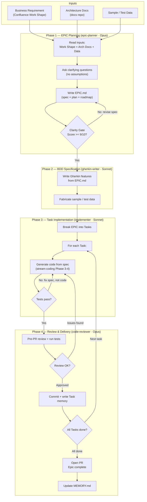

> ⚠️ **v1 (single-tier method) — retained for reference.** The current canon is the **two-tier model**: see [two-tier-methodology.md](two-tier-methodology.md) (+ [opsx-runbook.md](opsx-runbook.md), [openspec-setup-guide.md](openspec-setup-guide.md)). This v1 is kept live until the dogfood engagement closes, then removed.

# AI-Assisted Coding Runbook

**Audience:** Meaningfy developers using Claude Code for AI-assisted development.

**Purpose:** This runbook defines *how we work* with AI coding agents — the phases,
the agents, the memory conventions, and the quality gates. Follow this document as
your guide through the development lifecycle.

For setup and configuration details, see the companion
[AI Coding Setup Guide](ai-coding-setup-guide.md).

> **Model note (2026 revision).** This runbook predates two changes and is being migrated to them;
> a full alignment of the lifecycle diagram and phase tables below is pending. Read it through this
> lens until then:
>
> - **EPIC ≡ shape, plus a derived PLAN.** The shaped bet (appetite, problem, solution outline, key
>   decisions, rabbit-holes, no-gos) *is* the `EPIC.md`; the executable breakdown is a separate,
>   clarity-gated **`PLAN.md`** (≥9/10). Where the diagram and tables show a single two-part
>   `EPIC.md` carrying both spec and plan, read it as "shape the **EPIC** → derive the **PLAN**, and
>   gate the PLAN." See [the methodology, §1.1](ai-coding-methodology.md) and the `epic-planning` skill.
> - **Agents are now skills + three thin wrappers.** The catalog ships `epic-planner`, `implementer`,
>   and `code-reviewer` wrappers; the former `gherkin-writer` and `documenter` roles are now the
>   `bdd-gherkin` and `technical-writing` skills. Map any older agent name accordingly (see
>   [environment-setup.md §4](../environment-setup.md)).

---

## 1. Development Lifecycle Overview

The diagram below shows the end-to-end flow from business requirement to merged PR.
Each phase is owned by a specific agent with a designated model.



### Reading the diagram

| Shape | Meaning |
|-------|---------|
| Rectangle | An activity performed by an agent or developer |
| Diamond | A quality gate requiring a decision |
| Subgraph | A phase of the lifecycle (agent and model shown in header) |

### Developer vs. Agent responsibilities

| Phase | Developer does | Agent does |
|-------|---------------|------------|
| Phase 1 | Provides work shape, answers questions, approves spec | Reads inputs, asks questions, writes EPIC.md, runs Clarity Gate |
| Phase 2 | Reviews features for business accuracy | Writes Gherkin features, fabricates test data |
| Phase 3 | Approves each commit, intervenes on spec issues | Implements code, runs tests, writes task memory |
| Phase 4 | Decides which review issues to fix, triggers PR | Reviews code, runs tests, reports issues |

---

## 2. Phases in Detail

### Phase 1 — EPIC Planning

| | |
|---|---|
| **Agent** | `epic-planner` (Opus) |
| **Input** | Confluence Work Shape, architecture docs (docs repo), sample data |
| **Output** | `EPIC.md` in `.claude/memory/epics/<epic-name>/` |
| **Methodology** | Stream-coding Phases 1-2 (strategic thinking + AI-ready docs) |
| **Quality gate** | Clarity Gate (score >= 9/10 to proceed) |

The epic-planner agent:

1. Reads all available inputs (work shape, architecture docs, sample data).
2. Asks the developer clarifying questions — it makes **no assumptions**.
3. Produces an `EPIC.md` containing:
   - High-level description of the functionality
   - Terms / glossary / concept definitions (internal, for agent use)
   - High-level algorithm backed by a flow
   - Concrete examples (from sample data or fabricated)
   - Task breakdown with implementation plan
   - Roadmap with status indicators
4. Runs the Clarity Gate checklist and scores the spec.
5. Only proceeds when the spec scores >= 9/10.

**Input-output flow:** Architecture docs, the Confluence work shape, and any
available sample data are consumed by the epic-planner to produce the EPIC.md.
That spec then feeds the gherkin-writer (features + test data) and the
implementer (task-by-task execution), producing task outcome files as work
completes.

### Phase 2 — BDD Specification

| | |
|---|---|
| **Agent** | `gherkin-writer` (Sonnet) |
| **Input** | `EPIC.md` |
| **Output** | Gherkin `.feature` files under `tests/features/`, sample data |

The gherkin-writer agent:

1. Reads the `EPIC.md` spec.
2. Writes Gherkin feature files in business language.
3. Prefers `Scenario Outline` with `Examples:` for data-driven coverage.
4. Fabricates sample and test data where real examples are insufficient.
5. Does **not** write step definitions (that's the implementer's job).

### Phase 3 — Task Implementation

| | |
|---|---|
| **Agent** | `implementer` (Sonnet) |
| **Input** | A single Task from the EPIC breakdown, Gherkin features |
| **Output** | Production code + tests + step definitions |
| **Methodology** | Stream-coding Phases 3-4 (generate-verify-integrate loop) |

The implementer agent:

1. Reads the relevant Task from `EPIC.md` and corresponding Gherkin features.
2. Runs **gitnexus impact analysis** (`gitnexus_impact`) on any symbol it plans to
   modify before writing code.
3. Follows the stream-coding generate-verify-integrate loop, guided by
   pre-loaded skills:
   - **Generate:** tests first (TDD — `superpowers:test-driven-development`),
     then production code.
   - **Verify:** run tests immediately; apply `superpowers:systematic-debugging`
     when tests fail.
   - **Integrate:** present changes; wait for developer consent; commit using
     the `commit-commands:commit` skill.
4. Applies `superpowers:verification-before-completion` before claiming a task
   is done.
5. When tests fail due to a design issue: **fix the spec, not the code** (the golden rule).
6. Respects the Cosmic Python layered architecture:
   `entrypoints -> services -> models`, `adapters -> models`.

### Phase 4 — Review & Delivery

| | |
|---|---|
| **Agent** | `code-reviewer` (Opus) |
| **Input** | Staged changes from the implementer |
| **Output** | Review feedback or approval |

The code-reviewer agent:

1. Reviews code changes (read-only — cannot modify files).
2. Runs the full test suite.
3. Checks architectural conformance (layering, import rules).
4. Reports issues by priority: critical > warnings > suggestions.
5. If issues are found, the implementer fixes them.
6. On approval, the developer triggers commit and PR.

---

## 3. Memory Conventions

We use a **dual memory** approach: automatic memory for stable patterns, and
structured epic/task memory for project progress.

### 3.1 Auto-Memory (`.claude/memory/MEMORY.md`)

Claude automatically maintains this file with:

- Stable codebase patterns and conventions
- Key architectural decisions
- Important file paths and project structure
- Solutions to recurring problems

**Rules:**
- Kept to <= 200 lines (auto-loaded into every conversation).
- Updated after significant work sessions.
- Contains only **confirmed, stable** facts — not session-specific notes.

### 3.2 Epic/Task Memory (`.claude/memory/epics/`)

Structured memory files organised by epic:

```
.claude/memory/epics/
    <epic-name>/
        EPIC.md                          # Two-part: spec/plan + implementation log
        yyyy-mm-dd-<task-title>.md       # Two-part: task spec + implementation log
        yyyy-mm-dd-<task-title>.md
```

#### Two-part file structure

All memory files — both `EPIC.md` and task files — follow the same two-part structure:

```
# Part 1 — Specification
<!-- Written during Phases 1–2 (planning + test-writing). Do not modify during implementation. -->

[Spec content, plan, roadmap, acceptance criteria, Gherkin coverage]

---
<!-- implementation-log -->
---

# Part 2 — Implementation Log
<!-- Written and updated by the implementer throughout Phase 3. -->

[Progress entries, key decisions, deviations, commit links]
```

The separator `--- <!-- implementation-log --> ---` marks where planning ends
and execution begins. Agents treat everything above the separator as the
authoritative specification; everything below as the evolving implementation record.

#### EPIC.md

**Part 1 — Specification** (written by `epic-planner` and `gherkin-writer`):
- Description, glossary, algorithm/flow, concrete examples
- Anti-patterns, test case specifications, error handling matrix
- Task breakdown with layers, dependencies, acceptance criteria
- Roadmap with status checklist

**Part 2 — Implementation Log** (written by `implementer`, updated per task):
- Dated progress entries for each task as it completes
- Key implementation decisions and rationale
- Deviations from spec and why they were made
- Links to commits

#### Task files (`yyyy-mm-dd-<task-title>.md`)

**Part 1 — Task Specification** (written by `implementer` before starting the task):
- Task description (extracted from EPIC.md task breakdown)
- Acceptance criteria and layers affected
- Gherkin scenarios that cover this task

**Part 2 — Implementation Log** (filled in as the task progresses):
- What was accomplished (outcomes, not process)
- Key decisions made during implementation
- Deviations from spec and why
- Links to resulting commit(s)

**Rules:**
- One task file per story/task (ideally one corresponding commit or PR).
- Several tasks fulfil one EPIC.
- Agents do NOT auto-load all memory files — they read only the relevant
  epic folder when starting work on that epic.
- Files serve dual purpose: human inspection and agent context.

### 3.3 When Memory Gets Updated

| Event | What happens |
|-------|--------------|
| Starting work on an epic | Agent reads `EPIC.md` for that epic |
| Completing a task | Agent writes a task outcome file |
| End of a significant session | Agent updates `MEMORY.md` with stable patterns |
| Completing an epic | Agent updates `EPIC.md` status to complete |

---

## 4. Model Selection Guide

| Task Type | Model | Reasoning |
|-----------|-------|-----------|
| Planning, analysis, complex specs | **Opus** | Strongest reasoning, worth the cost for strategic work |
| Implementation, BDD tests | **Sonnet** | Strong coding, good balance of speed and quality |
| Explanations, summaries, docstrings | **Haiku** | Fast and cheap for low-complexity work |
| Pre-PR code review | **Opus** | Thorough analysis requires the strongest model |

**General rule:** Use planning mode (`/plan`) before writing to files — it's cheaper
and faster for reasoning-heavy work.

---

## 5. Commit and PR Conventions

### Commits

- Triggered by **medium-sized, conceptually atomic** chunks of work.
- Avoid mixing unrelated changes in one commit.
- Avoid large-scale commits (should be easy to review).
- Agent must **never commit without developer consent**.
- Commit messages: strict, succinct, describing the **final outcome** — not the
  process, not internal references, just what changed in the repository.
- No `Co-Authored-By` statements unless the developer explicitly requests them.

### Pull Requests

- Triggered upon completing an **EPIC implementation**.
- Exceptionally, large Epics may have intermediate PRs grouping several stories
  that deliver business value.
- PR description must reference the epic and summarise outcomes.

---

## 6. Agent Interaction Rules

These rules apply to **all agents** in the project:

### Always Do

- Read the relevant `EPIC.md` before starting implementation work.
- Run tests after every significant code change.
- Use project-specific tooling defined in `README.md` (like `make` targets).
- Signal to the developer when unrelated changes may be introduced (detect
  changes in subject/intention).
- Use `/context` to monitor token usage during long sessions.
- Use planning mode for reasoning-heavy work before writing files.

### Never Do

- Never commit without explicit developer consent.
- Never make assumptions — ask clarifying questions.
- Never manually patch AI-generated code without updating the spec first (the
  Rule of Divergence from stream-coding).
- Never auto-load all memory files from the epics folder (only load what's relevant).
- Never include internal memory references in commit messages.

---

## 7. Getting Started Checklist

For a new developer joining the project:

- [ ] Read this runbook end-to-end.
- [ ] Follow the [AI Coding Setup Guide](ai-coding-setup-guide.md) to configure
      your environment.
- [ ] Verify agents are loaded: run `/agents` in Claude Code.
- [ ] Verify skills are loaded: check `/skills` in Claude Code.
- [ ] **To start a new epic:** Provide a Confluence work shape to the
      `epic-planner` agent. It will produce the `EPIC.md`.
- [ ] **To join an existing epic:** Read the active `EPIC.md` in
      `.claude/memory/epics/<epic-name>/` for the work you'll contribute to.
- [ ] Start your first task by asking the `implementer` agent to pick up from
      the task breakdown in `EPIC.md`.

**Tip:** For parallel work on multiple features, consider using
[git worktrees](https://git-scm.com/docs/git-worktree) to maintain separate
working copies of the repository.

---

## 8. Quick Reference — Agent Cheat Sheet

```
/agents                          # List all available agents
/skills                          # List all loaded skills
/plan                            # Enter planning mode (read-only, cheaper)
/context                         # Check token usage
Use the epic-planner to ...      # Delegate to specific agent
Use the implementer to ...       # Delegate to specific agent
Use the code-reviewer to ...     # Delegate to specific agent
```

| What you want to do | Agent to use |
|---------------------|--------------|
| Write or refine an EPIC spec | `epic-planner` |
| Write Gherkin features from a spec | `gherkin-writer` |
| Implement a task from the EPIC | `implementer` |
| Review code before a PR | `code-reviewer` |
| Generate docs, summaries, explanations | `documenter` |
