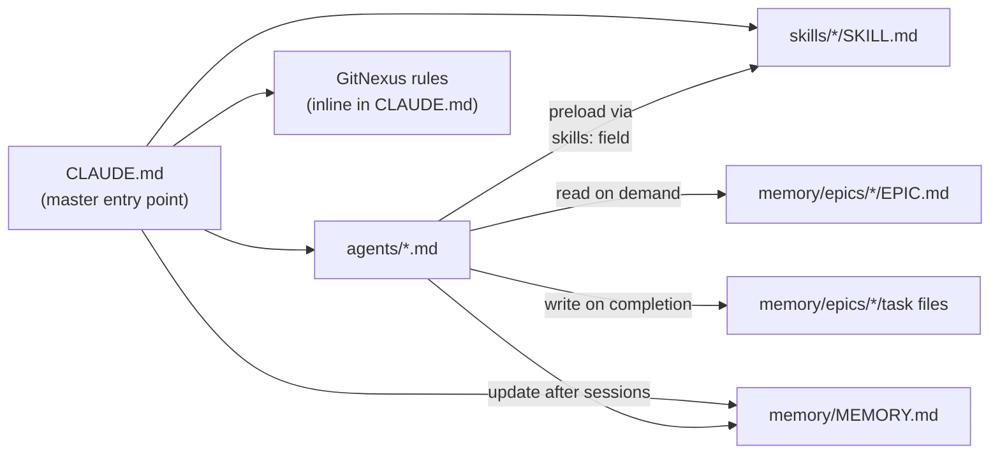

# AI Coding Setup Guide

**Audience:** Meaningfy developers setting up Claude Code on a new project repository.

**Purpose:** This guide explains the file structure, configuration, and how to
replicate the AI-assisted coding setup across project repositories.

For the methodology and workflow, see the companion
[AI Coding Runbook](ai-coding-runbook.md).

---

## 1. File Structure Overview

Every Meaningfy project repository follows this structure for AI coding support:

```
repo-root/
├── CLAUDE.md                              # Master agent instructions (entry point)
│
├── docs/ai-coding/
│   ├── ai-coding-runbook.md               # Developer runbook (methodology)
│   └── ai-coding-setup-guide.md           # This file
│
└── .claude/
    ├── settings.local.json                # Local permission overrides
    ├── agents/                            # Sub-agent definitions (one file each)
    │   ├── epic-planner.md
    │   ├── gherkin-writer.md
    │   ├── implementer.md
    │   ├── code-reviewer.md
    │   └── documenter.md
    ├── skills/                            # Skills (methodology + quality gates)
    │   ├── stream-coding/SKILL.md
    │   ├── clarity-gate/SKILL.md
    │   └── ...                            # Additional project-specific skills
    └── memory/
        ├── MEMORY.md                      # Auto-memory index (<= 200 lines)
        └── epics/                         # Epic/task outcome files
            └── <epic-name>/
                ├── EPIC.md
                └── yyyy-mm-dd-<task>.md
```

### File interconnections



### Prerequisites

- **Claude Code** installed and authenticated. See [Claude Code docs](https://code.claude.com).
- **Git** repository initialised with a `develop` branch (our PR target).
- **Node.js** (for GitNexus, if used): `npx` must be available.

---

## 2. CLAUDE.md — The Master Entry Point

`CLAUDE.md` sits at the repository root. It is the **first file Claude reads**
in every session. It must:

1. Define project-wide agent behaviour rules.
2. Reference the agent files, skills, and memory conventions.
3. Include GitNexus code intelligence rules (if the project uses GitNexus).
4. Stay concise — it's loaded into every conversation context.

### Structure of CLAUDE.md

```markdown
# Project: <project-name>

## Agent Behaviour Rules
(commit rules, memory rules, interaction rules)

## File References
(pointers to agents, skills, memory)

## Memory Conventions
(rules for auto-memory and epic/task memory)

## GitNexus — Code Intelligence
(inline GitNexus rules — if applicable)
```

See the actual `CLAUDE.md` in this repository as the reference implementation.

**Note:** The project-level `CLAUDE.md` complements the global `~/.claude/CLAUDE.md`
which contains Meaningfy-wide coding practices (Clean Code, SOLID, Cosmic Python,
testing strategy). Both are loaded into every conversation.

### 2.1 settings.local.json

The `.claude/settings.local.json` file controls local permission overrides —
tools that are auto-allowed without prompting. Example:

```json
{
  "permissions": {
    "allow": [
      "Bash(git rm:*)",
      "Bash(git reset:*)",
      "Skill(commit-commands:commit-push-pr)"
    ]
  }
}
```

This file is **not committed to git** (it's developer-specific). Each developer
can customise their permission comfort level.

---

## 3. Sub-Agent Configuration

Each agent lives in its own Markdown file under `.claude/agents/`. The file
uses YAML frontmatter for configuration and Markdown body for the system prompt.

### Agent file anatomy

```markdown
---
name: agent-name
description: When Claude should delegate to this agent (triggers automatic delegation)
model: opus | sonnet | haiku
tools: Tool1, Tool2, ...            # Allowlist (omit to inherit all)
disallowedTools: Tool1, ...         # Denylist
memory: project                     # Persistent memory scope
skills:                             # Skills preloaded into context
  - stream-coding
  - clarity-gate
---

You are a [role]. Your responsibility is [what you do].

[Detailed system prompt with instructions, constraints, output format...]
```

### Key frontmatter fields

| Field | Required | Purpose |
|-------|----------|---------|
| `name` | Yes | Unique identifier (lowercase, hyphens) |
| `description` | Yes | Triggers automatic delegation — write clearly |
| `model` | No | `opus`, `sonnet`, `haiku`, or `inherit` (default) |
| `tools` | No | Allowlist of tools; inherits all if omitted |
| `disallowedTools` | No | Tools to deny |
| `skills` | No | Skills injected into context at startup |
| `maxTurns` | No | Limit agentic turns before stopping |

### Our five agents

| Agent file | Model | Skills loaded | Tools |
|------------|-------|---------------|-------|
| `epic-planner.md` | opus | stream-coding, clarity-gate | Read, Grep, Glob, AskUserQuestion |
| `gherkin-writer.md` | sonnet | — | Read, Write, Edit, Glob, Grep, AskUserQuestion |
| `implementer.md` | sonnet | stream-coding, superpowers:test-driven-development, superpowers:systematic-debugging, superpowers:verification-before-completion | Read, Edit, Write, Glob, Grep, Bash, Skill |
| `code-reviewer.md` | opus | — | Read, Grep, Glob, Bash (deny: Write, Edit) |
| `documenter.md` | haiku | clarity-gate | Read, Write, Edit, Glob, Grep, AskUserQuestion |

### Writing effective agent descriptions

The `description` field is critical — Claude uses it to decide **when** to
delegate automatically. Best practices:

- Be specific about the task type: "Reviews code for quality" not "Helps with code"
- Include trigger phrases: "Use proactively after code changes"
- Mention what it does NOT do: "Read-only; does not modify code"

### Sub-agent limitations

- Sub-agents **cannot spawn other sub-agents** (no nesting).
- Sub-agents receive only their own system prompt + environment details,
  not the full Claude Code system prompt.
- Skills listed in `skills:` are **injected into context**, not just
  made available — keep the list focused.

---

## 4. Skills Configuration

Skills are reusable prompts that provide domain knowledge to agents. They live
under `.claude/skills/<skill-name>/SKILL.md`.

### Required skills

| Skill | Purpose | Used by |
|-------|---------|---------|
| `stream-coding` | Documentation-first development methodology (Phases 1-4) | epic-planner (context for Phases 1-2), implementer (active for Phases 3-4) |
| `clarity-gate` | Pre-ingestion quality verification for specs and docs | epic-planner (full gate), documenter (lightweight check) |

### Installing skills

**Option A — Copy from source repo:**

```bash
# Stream-coding
cp -r <stream-coding-repo>/.claude/skills/stream-coding .claude/skills/

# Clarity Gate
cp -r <clarity-gate-repo>/skills/clarity-gate .claude/skills/
```

**Option B — If skills are installed as plugins:**

Skills from plugins are auto-discovered. Check with `/skills` in Claude Code.

### Skills vs. agents

| | Skill | Agent |
|---|---|---|
| **Runs in** | Main conversation context | Isolated context window |
| **Purpose** | Domain knowledge, methodology | Task-specific autonomous work |
| **Context** | Injected into agent or conversation | Own system prompt only |
| **Tools** | Uses whatever the host has | Own tool restrictions |

**Rule of thumb:** Use skills for *knowledge*, agents for *action*.

---

## 5. Memory Configuration

### 5.1 Auto-memory (`MEMORY.md`)

Claude's built-in auto-memory writes to `.claude/memory/MEMORY.md`. This file:

- Is automatically loaded into every conversation (first 200 lines).
- Should contain only stable, confirmed facts about the codebase.
- Is updated by agents after significant work.

**What belongs in MEMORY.md:**
- Stable codebase patterns confirmed across multiple sessions
- Key architectural decisions and important file paths
- Solutions to recurring problems
- Project-specific conventions

**What does NOT belong:**
- Session-specific context or in-progress work
- Unverified conclusions from reading a single file
- Anything that duplicates CLAUDE.md instructions

### 5.2 Epic/Task memory

This is our custom convention (not a Claude built-in). It lives at
`.claude/memory/epics/` and is managed by explicit instructions in CLAUDE.md
and agent system prompts.

**Creating a new epic:**

```bash
mkdir -p .claude/memory/epics/<epic-name>
```

Then ask the `epic-planner` agent to write the `EPIC.md`.

**Task files** are written by agents when a task is completed. The naming
convention is `yyyy-mm-dd-<task-title>.md`.

---

## 6. MCP Servers and Plugins

MCP (Model Context Protocol) servers provide external tool access to agents.
They are configured in `.mcp.json` at the repository root or in
`~/.claude/.mcp.json` for user-level servers.

### Required MCP servers

| Server | Purpose | Scope | Install |
|--------|---------|-------|---------|
| GitNexus | Code intelligence, impact analysis before edits | Project | `npm install -g gitnexus` then `npx gitnexus analyze` |
| Context7 | Up-to-date library documentation | User | Via Claude Code MCP settings |

GitNexus is used by the `implementer` (blast radius before editing) and
`code-reviewer` (changed symbol impact). Both agents have explicit instructions
to call `gitnexus_impact` before/during their work.

### Required Plugins

Install these in Claude Code via `/plugin install <name>`:

| Plugin | Purpose | Which agents use it | Install command |
|--------|---------|---------------------|-----------------|
| `superpowers` | TDD, debugging, and verification skills injected into `implementer` | `implementer` | `/plugin install superpowers@claude-plugins-official` |
| `commit-commands` | Standardised commit/push/PR workflow | `implementer` (via `Skill` tool) | `/plugin install commit-commands@claude-plugins-official` |
| `code-review` | PR review command | Main conversation | `/plugin install code-review@claude-plugins-official` |

#### Superpowers skills loaded per agent

The `implementer` agent has these superpowers skills pre-loaded into context:

| Skill | When it activates |
|-------|-------------------|
| `superpowers:test-driven-development` | Enforces RED-GREEN-REFACTOR during code generation |
| `superpowers:systematic-debugging` | When tests fail — 4-phase root cause analysis |
| `superpowers:verification-before-completion` | Before claiming a task is done |

The `implementer` also has the `Skill` tool available to explicitly invoke
`commit-commands:commit` when the developer approves changes.

### Configuration (`.mcp.json`)

Place this file at the repository root. Claude Code reads it at session start
and launches the listed MCP servers automatically.

```json
{
  "mcpServers": {
    "gitnexus": {
      "command": "npx",
      "args": ["gitnexus", "mcp"]
    }
  }
}
```

This file is already present in this repository. Copy it as-is when
replicating to a new repo (see §7). If the gitnexus MCP server is not
available during a session, agents will instruct you to restart Claude Code
to reload it.

### Making MCP servers available to agents

Agents inherit MCP servers from the main conversation by default. To restrict
or add specific servers for an agent, use the `mcpServers` field in the agent's
frontmatter.

---

## 7. Adapting This Setup to a New Repository

### Step-by-step

1. **Copy the template structure:**
   ```bash
   # From this repository, copy:
   cp CLAUDE.md <new-repo>/
   cp .mcp.json <new-repo>/
   cp -r .claude/agents <new-repo>/.claude/
   cp -r .claude/skills <new-repo>/.claude/
   mkdir -p <new-repo>/.claude/memory/epics
   mkdir -p <new-repo>/docs/ai-coding
   cp docs/ai-coding/*.md <new-repo>/docs/ai-coding/
   ```

2. **Customise CLAUDE.md:**
   - Update the project name and description.
   - Adjust GitNexus references to the new repo name.
   - Add any project-specific rules or conventions.

3. **Customise agent prompts:**
   - Review each agent's system prompt for project-specific references.
   - Adjust tool restrictions if the project has different needs.
   - Update skill references if the project uses additional skills.

4. **Initialise memory:**
   ```bash
   touch <new-repo>/.claude/memory/MEMORY.md
   ```

5. **Configure MCP servers** (if needed):
   ```bash
   # Initialise GitNexus
   cd <new-repo>
   npx gitnexus analyze
   ```

6. **Verify the setup:**
   ```
   /agents          # Should list all 5 agents
   /skills          # Should show stream-coding and clarity-gate
   ```

### What to fine-tune per repository

| Item | What to customise |
|------|-------------------|
| `CLAUDE.md` | Project name, specific conventions, make targets, GitNexus repo name |
| Agent system prompts | Domain-specific instructions, architectural patterns |
| Skills | Add project-specific skills as needed |
| MCP servers | Add/remove based on project needs |

### What stays the same across repositories

| Item | Why it's standard |
|------|-------------------|
| Directory structure | Consistency across repos |
| Agent names and roles | Same methodology everywhere |
| Memory conventions | Same workflow everywhere |
| Runbook and setup guide | Same methodology documentation |

---

## 8. Troubleshooting

| Problem | Solution |
|---------|----------|
| Agent not appearing in `/agents` | Restart Claude Code session, or check YAML frontmatter syntax |
| Skill not loading | Verify file is at `.claude/skills/<name>/SKILL.md` exactly |
| Memory files growing too large | Curate `MEMORY.md` to <= 200 lines; archive old epic folders |
| Agent using wrong model | Check `model:` field in agent frontmatter |
| Agent doing things it shouldn't | Add restrictions via `disallowedTools:` in frontmatter |
| GitNexus index stale | Run `npx gitnexus analyze` |
| Context window filling up | Use `/context` to check; use agents to isolate heavy operations |
