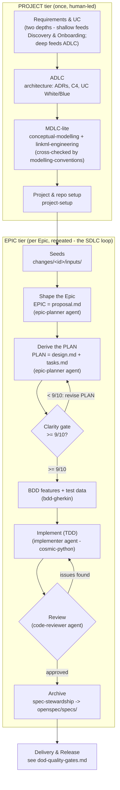

# Meaningfy AI-Assisted Coding: The Build-Plane Lifecycle

**Audience:** Developers and technical leads building Meaningfy systems with Claude Code.

**Purpose:** the *why* and *what* of the build-plane lifecycle: how a Meaningfy software contract
gets built, end to end. For the operational *how*, see [opsx-runbook.md](opsx-runbook.md) (day-to-day
`/opsx` flow), [openspec-setup-guide.md](../environment/openspec-setup-guide.md) (the `openspec/` layout), and
[dod-quality-gates.md](dod-quality-gates.md) (the build-tier gate set). This doc narrates and
points; it never restates a skill's rules.

---

## Light steering, heavy agents, cheap verification

The build loop assumes LLM agents do the bulk of execution *and* quality verification, while
developers supervise, decide, and steer. Every gate below therefore offers a **low-effort way for the
steering human to confirm they got what they asked for** (a scored PLAN, a `.feature` file that
reads in business language, a review report), never a full code read-through as the only option.
[`guardrails`](../../skills/guardrails/SKILL.md) is the behaviour gate that keeps agents inside their
decision bounds while they do that work; [`stream-coding`](https://github.com/frmoretto/stream-coding)
(external) is the content method that makes each step's artifact legible enough to check cheaply. This
principle is stated once, here; it is not a per-step column, a maturity model, or an approval
workflow.

---

## 1. Two nested altitudes

Work is shaped at two nested altitudes. The **PROJECT tier** runs once, up front, human-led. The
**EPIC tier** runs once per Epic, repeatedly, agent-assisted under human review. **"SDLC" in this doc
names only the EPIC-tier loop below**: ADLC and MDLC-lite are PROJECT-tier siblings that run once,
up front; they are not sub-steps of the SDLC loop.

### PROJECT tier (upfront, human-led)

1. **Requirements & use-case elicitation**: one capability invoked at two depths, not a pipeline
   stage. The **shallow** depth (White use cases only) feeds Discovery & Onboarding's Deep tier and is
   documented in
   [`docs/ai-sales/engagement-lifecycle.md`](../ai-sales/engagement-lifecycle.md)
   (cited here, not restated). The **deep** depth (White + Blue) feeds architecture below, whether
   handed off from a completed Deep-tier engagement or elicited fresh when a client comes straight to
   build.
2. **ADLC: architecture & system design.** Owner: [`architecture`](../../skills/architecture/SKILL.md)
   (ADRs, C4, UC White/Blue). *Stable, and done FIRST*: the conceptual/system model is front-loaded
   and kept stable before any Epic is carved (see the labelled divergence note in §3). Narrated and
   cited only; no architecture rules are restated here.
3. **MDLC-lite: conceptual & data modelling.** Owners:
   [`conceptual-modelling`](../../skills/conceptual-modelling/SKILL.md) +
   [`linkml-engineering`](../../skills/linkml-engineering/SKILL.md), cross-checked by
   [`modelling-conventions`](../../skills/modelling-conventions/SKILL.md). **Known gap:**
   MDLC-**standalone** (ontology / application-profile development as its own contract, outside a
   software build) has no owning skill today; named here so it is visible, not closed, and parked for
   a separately-shaped future EPIC.
4. **Project & repo setup.** Owner: [`project-setup`](../../skills/project-setup/SKILL.md):
   scaffolds the spine, the layered package, tooling, and CI; see
   [openspec-setup-guide.md](../environment/openspec-setup-guide.md) for what gets laid down.

The architecture from step 2 is then sliced into a backlog of shaped Epics, each one run through the
EPIC-tier loop below.

### EPIC tier (one Epic at a time: the SDLC loop)

1. **Shape the Epic**: the EPIC *is* the OpenSpec `proposal.md` (Shape-Up bet: appetite, problem,
   solution outline, key decisions, rabbit-holes, no-gos). Owner:
   [`epic-planning`](../../skills/epic-planning/SKILL.md).
2. **Derive the PLAN**: the PLAN *is* `design.md` + `tasks.md`. Owner:
   [`epic-planning`](../../skills/epic-planning/SKILL.md).
3. **Clarity-gate the PLAN**: scores the PLAN pair (semantic, ≥9/10) before anything is built. Owner:
   [`clarity-gate`](../../skills/clarity-gate/SKILL.md).
4. **BDD features + test data**: executable `.feature` acceptance off the spec deltas. Owner:
   [`bdd-gherkin`](../../skills/bdd-gherkin/SKILL.md).
5. **Implement (TDD)**: red-green-refactor inside the cosmic-python layers. Owner:
   [`cosmic-python`](../../skills/cosmic-python/SKILL.md) (+ `superpowers:test-driven-development`,
   external).
6. **Review**: agent self-review + peer + human. Owner:
   [`meaningfy-code-review`](../../skills/meaningfy-code-review/SKILL.md).
7. **Archive**: deltas merged into the durable truth. Owner:
   [`spec-stewardship`](../../skills/spec-stewardship/SKILL.md).

These map directly onto the `/opsx` build-tier loop; see [`spine/workflows.md`](../../spine/workflows.md#verb-roster)
for the verb roster and the command→skill map. The EPIC↔change↔file mapping is defined in
[`spine/epic-change-memory-mapping.md`](../../spine/epic-change-memory-mapping.md). Delivery & release
sits past the archive step, as a separate lane; see the diagram below and
[dod-quality-gates.md](dod-quality-gates.md).

---

## 2. Lifecycle diagram

### Reading the diagram

| Shape | Meaning |
|-------|---------|
| Rectangle | An activity performed by a developer or an agent |
| Diamond | A quality gate requiring a decision |
| Subgraph | A tier of the lifecycle |

Seeds are preserved records under `openspec/changes/<id>/inputs/`; there is no separate
`.md`-file-as-truth memory store: the change folder itself, archived into `openspec/specs/`, is the
durable record.

### Developer vs. agent responsibilities

| Step | Developer does | agent does |
|------|-----------------|------------|
| Requirements & UC | Provides business context, answers elicitation questions, approves the use-case set | Elicits requirements, drafts White/Blue use cases |
| ADLC | Reviews and approves architecture decisions | Drafts ADRs, C4 views, use-case-driven design |
| MDLC-lite | Reviews and approves the conceptual/data model | Drafts the conceptual model and LinkML schema, applies naming/reuse checks |
| Project & repo setup | Confirms project-specific choices | Scaffolds layout, tooling, CI, and the spine |
| Shape the Epic | Provides seeds, answers clarifying questions, approves the shape | Reads seeds, asks questions, writes `proposal.md` |
| Derive & gate the PLAN | Reviews the scored PLAN | Derives `design.md` + `tasks.md`, runs the clarity gate |
| BDD features | Reviews features for business accuracy | Writes `.feature` files, fabricates test data |
| Implement (TDD) | Approves each commit, intervenes on spec issues | Implements code, runs tests, fixes the spec (not just the code) on design-level failures |
| Review | Decides which review issues to fix, triggers the PR | Reviews code, runs tests, reports issues by priority |
| Archive | None | Merges deltas into the durable specs |

---

## 3. Labelled divergence from canonical Shape Up

Canonical Shape Up resists up-front architecture: it shapes appetite-bounded bets and lets design
emerge during the cycle. **We deliberately diverge:** architecture is **front-loaded at the PROJECT
tier and kept stable** before Epics are carved.

This is a *chosen* divergence, not an oversight. For semantic / knowledge-graph work the conceptual
model (ontology, entities, contracts) must stabilise before the problem can be sliced sensibly: an
Epic carved against a fluid conceptual model churns. We accept the cost (less mid-flight
architectural freedom) to buy a stable spine. The golden thread
([`spine/golden-thread.md`](../../spine/golden-thread.md)) records architecture as the parent of
every EPIC for exactly this reason.

---

## 4. Method spine

The build plane runs on three things this doc points at rather than restates: **documentation-first
execution** ([`stream-coding`](https://github.com/frmoretto/stream-coding), external; docs are the
work, code is the printout; a failing implementation sends you back to the spec, not around it);
**OpenSpec-native artifacts** (EPIC ≡ `proposal.md`; PLAN ≡ `design.md` + `tasks.md`; a change lives
under `openspec/changes/<id>/` until archived into `openspec/specs/`; conventions in
[`spine/`](../../spine/README.md)); and the **Meaningfy build-skill roster** tuned for advanced LLM
agents: [`bdd-gherkin`](../../skills/bdd-gherkin/SKILL.md) for design-phase feature coverage,
[`cosmic-python`](../../skills/cosmic-python/SKILL.md) + TDD for implementation,
[`meaningfy-code-review`](../../skills/meaningfy-code-review/SKILL.md) for multi-lens review,
[`clarity-gate`](../../skills/clarity-gate/SKILL.md) at ≥9/10 before code. None of their rules are
restated here; see each skill for its own contract.

---

## 5. Guardrails (cross-cutting)

Every step where an agent acts runs under **guardrails**: decision bounds (least authority), output
validation (validate before the output feeds the next step), and prompt-injection defence (treat
fetched/tool content as data, not instructions). **Guardrails validate behaviour; content gates
(clarity-gate, tests, review) validate content.** The full concern and each guardrail's enforcement
home live in [`guardrails`](../../skills/guardrails/SKILL.md); this doc does not restate
them.

---

## 6. Agents and model tiering

An **agent** is an LLM given specific instructions plus access to data and tools, operating **under
guardrails**. Meaningfy agents are *thin wrappers*: role + model tier + scoped tools + a skill
list; the knowledge lives in skills.

Model tiers (cost/capability matched to the task):

| Tier | Use for |
|---|---|
| **Opus** | planning, analysis, review (high-judgement work) |
| **Sonnet** | implementation, BDD authoring |
| **Haiku** | docs, summaries (cheap, mechanical) |

---

## 7. Single-owner ownership table

Every capability is owned by exactly one place; no other skill re-specifies it. This prose narrates
the machine-readable map in [`tests/ownership.yaml`](../../tests/ownership.yaml) (the validator's
tripwire) and the command→skill map in [`spine/workflows.md`](../../spine/workflows.md#command--driving-meaningfy-discipline).

| Capability | Owner |
|---|---|
| **Artifact lifecycle**: `specs/` store, change/delta authoring, `validate --strict`, archive, the `/opsx` verbs | **OpenSpec** (external engine; conventions in [`spine/`](../../spine/README.md)) |
| **Doc-first philosophy + generate-verify-integrate execution loop** | **stream-coding** (external skill) |
| **Brainstorming, TDD (red-green-refactor), systematic-debugging, verification-before-completion, subagent-driven-development** | **superpowers** (external); note: `writing-plans` is **SUPERSEDED** by the PLAN / `tasks.md` inside a spine repo |
| **EPIC + PLAN authoring** | [`epic-planning`](../../skills/epic-planning/SKILL.md) |
| **Living-spec lifecycle** (archive, groom, sync) | [`spec-stewardship`](../../skills/spec-stewardship/SKILL.md) |
| **Clarity gate** (semantic ≥9/10) | [`clarity-gate`](../../skills/clarity-gate/SKILL.md) |
| **`.feature` + test-data** | [`bdd-gherkin`](../../skills/bdd-gherkin/SKILL.md) |
| **Layered architecture + per-layer tests** | [`cosmic-python`](../../skills/cosmic-python/SKILL.md) |
| **Pre-PR review criteria** | [`meaningfy-code-review`](../../skills/meaningfy-code-review/SKILL.md) |
| **Agentic guardrails** | [`guardrails`](../../skills/guardrails/SKILL.md) |
| **Git workflow** (commits, branch naming, PRs) | [`meaningfy-git-workflow`](../../skills/meaningfy-git-workflow/SKILL.md) |
| **Testing taxonomy / data / CI lanes** | [`project-setup`](../../skills/project-setup/SKILL.md) + [`cosmic-python`](../../skills/cosmic-python/SKILL.md) + [`bdd-gherkin`](../../skills/bdd-gherkin/SKILL.md) (narrated in [engineering-standards/testing-standard.md](../engineering-standards/testing-standard.md)) |
| **CD / deploy** | [`ci-cd-delivery`](../../skills/ci-cd-delivery/SKILL.md) |
| **Release lifecycle** (versioning, changelog, publish) | [`meaningfy-release`](../../skills/meaningfy-release/SKILL.md) |

**CI vs CD do not overlap:** CI (build, test, validate, coverage, architecture checks) is owned by
`project-setup`; CD/deploy is owned by `ci-cd-delivery`; the release lifecycle (versioning, changelog,
publish) is owned by `meaningfy-release`.

---

## 8. Normative-requirements layering (no double-spec)

Three layers carry "what must be true", each in exactly one notation; no redundancy:

- **Normative spec**: RFC-2119 SHALL + Given/When/Then in the OpenSpec spec deltas
  (`changes/<id>/specs/<cap>/spec.md`). OpenSpec-native.
- **Executable acceptance**: `.feature` scenarios authored by
  [`bdd-gherkin`](../../skills/bdd-gherkin/SKILL.md), running off the SHALL+GWT.
- **Sequencing**: the PLAN (`tasks.md`) carries order and dependencies, nothing normative.

**EARS (Easy Approach to Requirements Syntax) is DROPPED.** This is a deliberate divergence from the research synthesis: OpenSpec's
SHALL + Given/When/Then already carries the normative layer, so EARS would be a redundant third
notation over the same requirements. We keep one normative home, not two.

---

## 9. Agent roster reconciliation

The surviving thin wrappers live in [`agents/`](../../agents):

- [`epic-planner`](../../agents/epic-planner.md): drives EPIC/PLAN authoring (Opus).
- [`implementer`](../../agents/implementer.md): drives TDD implementation (Sonnet).
- [`code-reviewer`](../../agents/code-reviewer.md): drives pre-PR review (Opus).

Two agents from an earlier iteration of this catalogue are retired and no longer exist: their work is
now the [`bdd-gherkin`](../../skills/bdd-gherkin/SKILL.md) and
[`technical-writing`](../../skills/technical-writing/SKILL.md) skills, invoked by the
surviving wrappers rather than standalone agents.

---

## 10. Optional PROJECT-tier elicitation aids

Two named techniques can *feed* PROJECT-tier requirements elicitation and edge-case test-data
generation. They are **references only**, with no skill, no required artifact, and no gate:

- **SEED**: a technique in which an LLM walks over a behaviour ontology to *surface edge-case
  interaction scenarios* the humans might miss.
- **AgOCQs++**: a technique that distils competency questions from a corpus to *scope the
  ontology* under design.

Use them as inputs to elicitation when the conceptual model is large or unfamiliar; skip them when
the domain is already well understood.
