# Skill inventory

<!-- GENERATED by `python -m tools.skill_inventory` (or `make skill-inventory`) —
     DO NOT hand-edit. Source: each skill's SKILL.md frontmatter/body,
     .claude-plugin/marketplace.json, and this file's own PURPOSE_OF/PURPOSE_BLURB
     mappings. tests/test_skill_inventory.py fails the build if this drifts. -->

32 skills across 5 bundles (role bundles plus the `vault-assistant` workflow bundle). Install `meaningfy-core` plus the bundle(s) matching your role — see the root [`README.md`](../README.md).

## Map

**Containers** are bundles. **Dark rectangles** are skills. **Light rounded cards** are the small set of purposes a skill's description was sorted into, cutting across bundles — each with a one-line explanation of what it covers. The line is *classified as* (skill → purpose).

```mermaid
%%{init: {'flowchart': {'nodeSpacing': 12, 'rankSpacing': 45, 'curve': 'basis'}}}%%
flowchart LR
  subgraph b_meaningfy_core["meaningfy-core"]
    s_technical_writing["technical-writing"]
    s_explanatory_writing["explanatory-writing"]
    s_writing_antipatterns["writing-antipatterns"]
    s_meaningfy_git_workflow["meaningfy-git-workflow"]
    s_guardrails["guardrails"]
  end
  subgraph b_meaningfy_consulting["meaningfy-consulting"]
    s_semantic_consulting_coach["semantic-consulting-coach"]
    s_decision_package["decision-package"]
    s_proposal_writing["proposal-writing"]
    s_estimation["estimation"]
    s_executive_communication["executive-communication"]
  end
  subgraph b_meaningfy_architecture["meaningfy-architecture"]
    s_architecture["architecture"]
    s_conceptual_modelling["conceptual-modelling"]
    s_modelling_conventions["modelling-conventions"]
    s_linkml_engineering["linkml-engineering"]
  end
  subgraph b_meaningfy_building["meaningfy-building"]
    s_epic_planning["epic-planning"]
    s_spec_stewardship["spec-stewardship"]
    s_clarity_gate["clarity-gate"]
    s_bdd_gherkin["bdd-gherkin"]
    s_meaningfy_code_review["meaningfy-code-review"]
    s_cosmic_python["cosmic-python"]
    s_project_setup["project-setup"]
    s_ci_cd_delivery["ci-cd-delivery"]
    s_meaningfy_release["meaningfy-release"]
  end
  subgraph b_vault_assistant["vault-assistant"]
    s_vault_setup["vault-setup"]
    s_vault_conventions["vault-conventions"]
    s_vault_project["vault-project"]
    s_vault_resume["vault-resume"]
    s_vault_capture["vault-capture"]
    s_vault_promote["vault-promote"]
    s_vault_tidy["vault-tidy"]
    s_vault_planning["vault-planning"]
    s_vault_daily["vault-daily"]
  end

  p_consulting_business("Consulting & Business<br/><sub>front-of-funnel advisory work</sub>")
  p_delivery_ops("Delivery & Ops<br/><sub>scaffolding, CI/CD, releases</sub>")
  p_modelling_architecture("Modelling & Architecture<br/><sub>domain models, system design, LinkML</sub>")
  p_personal_vault("Personal Vault<br/><sub>a personal Obsidian vault and its daily rhythm</sub>")
  p_process_governance("Process & Governance<br/><sub>the spine build loop + agentic guardrails</sub>")
  p_quality_review("Quality & Review<br/><sub>tests, BDD, pre-PR review</sub>")
  p_writing_communication("Writing & Communication<br/><sub>clear prose, persuasion, teaching</sub>")

  s_architecture --> p_modelling_architecture
  s_bdd_gherkin --> p_quality_review
  s_ci_cd_delivery --> p_delivery_ops
  s_clarity_gate --> p_process_governance
  s_conceptual_modelling --> p_modelling_architecture
  s_cosmic_python --> p_modelling_architecture
  s_decision_package --> p_consulting_business
  s_epic_planning --> p_process_governance
  s_estimation --> p_consulting_business
  s_executive_communication --> p_writing_communication
  s_explanatory_writing --> p_writing_communication
  s_guardrails --> p_process_governance
  s_linkml_engineering --> p_modelling_architecture
  s_meaningfy_code_review --> p_quality_review
  s_meaningfy_git_workflow --> p_delivery_ops
  s_meaningfy_release --> p_delivery_ops
  s_modelling_conventions --> p_modelling_architecture
  s_project_setup --> p_delivery_ops
  s_proposal_writing --> p_consulting_business
  s_semantic_consulting_coach --> p_consulting_business
  s_spec_stewardship --> p_process_governance
  s_technical_writing --> p_writing_communication
  s_vault_capture --> p_personal_vault
  s_vault_conventions --> p_personal_vault
  s_vault_daily --> p_personal_vault
  s_vault_planning --> p_personal_vault
  s_vault_project --> p_personal_vault
  s_vault_promote --> p_personal_vault
  s_vault_resume --> p_personal_vault
  s_vault_setup --> p_personal_vault
  s_vault_tidy --> p_personal_vault
  s_writing_antipatterns --> p_writing_communication

  style b_meaningfy_core fill:#eaf3ff,stroke:#999,stroke-width:1px
  style b_meaningfy_consulting fill:#fff2e0,stroke:#999,stroke-width:1px
  style b_meaningfy_architecture fill:#eafaf0,stroke:#999,stroke-width:1px
  style b_meaningfy_building fill:#f5eaff,stroke:#999,stroke-width:1px
  style b_vault_assistant fill:#eaf3ff,stroke:#999,stroke-width:1px
  style p_consulting_business fill:#fdeef7,color:#000000,stroke:#333,stroke-width:1.5px
  style p_delivery_ops fill:#f6f5ef,color:#000000,stroke:#333,stroke-width:1.5px
  style p_modelling_architecture fill:#eafaf5,color:#000000,stroke:#333,stroke-width:1.5px
  style p_personal_vault fill:#eef7fb,color:#000000,stroke:#333,stroke-width:1.5px
  style p_process_governance fill:#eef1fb,color:#000000,stroke:#333,stroke-width:1.5px
  style p_quality_review fill:#fdeef0,color:#000000,stroke:#333,stroke-width:1.5px
  style p_writing_communication fill:#fdf6e3,color:#000000,stroke:#333,stroke-width:1.5px
  style s_architecture fill:#1e1e1e,color:#ffffff,stroke:#000
  style s_bdd_gherkin fill:#1e1e1e,color:#ffffff,stroke:#000
  style s_ci_cd_delivery fill:#1e1e1e,color:#ffffff,stroke:#000
  style s_clarity_gate fill:#1e1e1e,color:#ffffff,stroke:#000
  style s_conceptual_modelling fill:#1e1e1e,color:#ffffff,stroke:#000
  style s_cosmic_python fill:#1e1e1e,color:#ffffff,stroke:#000
  style s_decision_package fill:#1e1e1e,color:#ffffff,stroke:#000
  style s_epic_planning fill:#1e1e1e,color:#ffffff,stroke:#000
  style s_estimation fill:#1e1e1e,color:#ffffff,stroke:#000
  style s_executive_communication fill:#1e1e1e,color:#ffffff,stroke:#000
  style s_explanatory_writing fill:#1e1e1e,color:#ffffff,stroke:#000
  style s_guardrails fill:#1e1e1e,color:#ffffff,stroke:#000
  style s_linkml_engineering fill:#1e1e1e,color:#ffffff,stroke:#000
  style s_meaningfy_code_review fill:#1e1e1e,color:#ffffff,stroke:#000
  style s_meaningfy_git_workflow fill:#1e1e1e,color:#ffffff,stroke:#000
  style s_meaningfy_release fill:#1e1e1e,color:#ffffff,stroke:#000
  style s_modelling_conventions fill:#1e1e1e,color:#ffffff,stroke:#000
  style s_project_setup fill:#1e1e1e,color:#ffffff,stroke:#000
  style s_proposal_writing fill:#1e1e1e,color:#ffffff,stroke:#000
  style s_semantic_consulting_coach fill:#1e1e1e,color:#ffffff,stroke:#000
  style s_spec_stewardship fill:#1e1e1e,color:#ffffff,stroke:#000
  style s_technical_writing fill:#1e1e1e,color:#ffffff,stroke:#000
  style s_vault_capture fill:#1e1e1e,color:#ffffff,stroke:#000
  style s_vault_conventions fill:#1e1e1e,color:#ffffff,stroke:#000
  style s_vault_daily fill:#1e1e1e,color:#ffffff,stroke:#000
  style s_vault_planning fill:#1e1e1e,color:#ffffff,stroke:#000
  style s_vault_project fill:#1e1e1e,color:#ffffff,stroke:#000
  style s_vault_promote fill:#1e1e1e,color:#ffffff,stroke:#000
  style s_vault_resume fill:#1e1e1e,color:#ffffff,stroke:#000
  style s_vault_setup fill:#1e1e1e,color:#ffffff,stroke:#000
  style s_vault_tidy fill:#1e1e1e,color:#ffffff,stroke:#000
  style s_writing_antipatterns fill:#1e1e1e,color:#ffffff,stroke:#000
```

## Relations

Same bundle containers as the Map, but skill boxes are now colour-coded by **purpose** (the same six categories, one dark shade each) instead of uniform dark — at this many edges, colour is what makes the grouping legible without tracing every line. Two line types, not one: a **thick solid** arrow is *depends on* (63 edges, mechanically parsed from each skill's own "Delegates" text — a skill explicitly handing something off to another); a **thin dashed** arrow is *related* (85 edges, everything else in the "Related" list — weaker, a "see also" rather than a hand-off). Kept separate from the Map's classification edges — 148 relation edges plus 32 classification edges in one diagram was tried and was a long-crossing-line mess, confirmed by actually rendering it.

```mermaid
%%{init: {'flowchart': {'nodeSpacing': 12, 'rankSpacing': 45, 'curve': 'basis'}}}%%
flowchart LR
  subgraph b_meaningfy_core["meaningfy-core"]
    s_technical_writing["technical-writing"]
    s_explanatory_writing["explanatory-writing"]
    s_writing_antipatterns["writing-antipatterns"]
    s_meaningfy_git_workflow["meaningfy-git-workflow"]
    s_guardrails["guardrails"]
  end
  subgraph b_meaningfy_consulting["meaningfy-consulting"]
    s_semantic_consulting_coach["semantic-consulting-coach"]
    s_decision_package["decision-package"]
    s_proposal_writing["proposal-writing"]
    s_estimation["estimation"]
    s_executive_communication["executive-communication"]
  end
  subgraph b_meaningfy_architecture["meaningfy-architecture"]
    s_architecture["architecture"]
    s_conceptual_modelling["conceptual-modelling"]
    s_modelling_conventions["modelling-conventions"]
    s_linkml_engineering["linkml-engineering"]
  end
  subgraph b_meaningfy_building["meaningfy-building"]
    s_epic_planning["epic-planning"]
    s_spec_stewardship["spec-stewardship"]
    s_clarity_gate["clarity-gate"]
    s_bdd_gherkin["bdd-gherkin"]
    s_meaningfy_code_review["meaningfy-code-review"]
    s_cosmic_python["cosmic-python"]
    s_project_setup["project-setup"]
    s_ci_cd_delivery["ci-cd-delivery"]
    s_meaningfy_release["meaningfy-release"]
  end
  subgraph b_vault_assistant["vault-assistant"]
    s_vault_setup["vault-setup"]
    s_vault_conventions["vault-conventions"]
    s_vault_project["vault-project"]
    s_vault_resume["vault-resume"]
    s_vault_capture["vault-capture"]
    s_vault_promote["vault-promote"]
    s_vault_tidy["vault-tidy"]
    s_vault_planning["vault-planning"]
    s_vault_daily["vault-daily"]
  end

  s_ci_cd_delivery ==> s_project_setup
  s_ci_cd_delivery ==> s_cosmic_python
  s_conceptual_modelling ==> s_linkml_engineering
  s_cosmic_python ==> s_architecture
  s_cosmic_python ==> s_conceptual_modelling
  s_cosmic_python ==> s_linkml_engineering
  s_cosmic_python ==> s_meaningfy_git_workflow
  s_cosmic_python ==> s_guardrails
  s_decision_package ==> s_proposal_writing
  s_epic_planning ==> s_clarity_gate
  s_epic_planning ==> s_spec_stewardship
  s_epic_planning ==> s_bdd_gherkin
  s_epic_planning ==> s_cosmic_python
  s_epic_planning ==> s_technical_writing
  s_epic_planning ==> s_explanatory_writing
  s_estimation ==> s_proposal_writing
  s_estimation ==> s_epic_planning
  s_estimation ==> s_decision_package
  s_executive_communication ==> s_clarity_gate
  s_executive_communication ==> s_technical_writing
  s_guardrails ==> s_clarity_gate
  s_guardrails ==> s_cosmic_python
  s_guardrails ==> s_meaningfy_code_review
  s_linkml_engineering ==> s_project_setup
  s_project_setup ==> s_cosmic_python
  s_project_setup ==> s_architecture
  s_project_setup ==> s_epic_planning
  s_project_setup ==> s_technical_writing
  s_project_setup ==> s_meaningfy_git_workflow
  s_proposal_writing ==> s_estimation
  s_proposal_writing ==> s_executive_communication
  s_proposal_writing ==> s_decision_package
  s_proposal_writing ==> s_semantic_consulting_coach
  s_semantic_consulting_coach ==> s_executive_communication
  s_semantic_consulting_coach ==> s_decision_package
  s_semantic_consulting_coach ==> s_proposal_writing
  s_semantic_consulting_coach ==> s_estimation
  s_spec_stewardship ==> s_epic_planning
  s_spec_stewardship ==> s_clarity_gate
  s_vault_capture ==> s_vault_conventions
  s_vault_capture ==> s_vault_resume
  s_vault_capture ==> s_vault_project
  s_vault_conventions ==> s_vault_setup
  s_vault_daily ==> s_vault_conventions
  s_vault_daily ==> s_vault_planning
  s_vault_daily ==> s_vault_setup
  s_vault_planning ==> s_vault_conventions
  s_vault_planning ==> s_vault_daily
  s_vault_planning ==> s_vault_promote
  s_vault_planning ==> s_vault_tidy
  s_vault_project ==> s_vault_conventions
  s_vault_project ==> s_vault_resume
  s_vault_project ==> s_vault_capture
  s_vault_promote ==> s_vault_conventions
  s_vault_promote ==> s_vault_tidy
  s_vault_resume ==> s_vault_conventions
  s_vault_resume ==> s_vault_capture
  s_vault_resume ==> s_vault_project
  s_vault_setup ==> s_vault_conventions
  s_vault_setup ==> s_project_setup
  s_vault_tidy ==> s_vault_conventions
  s_vault_tidy ==> s_vault_promote
  s_vault_tidy ==> s_vault_project

  s_architecture -.-> s_cosmic_python
  s_architecture -.-> s_epic_planning
  s_architecture -.-> s_writing_antipatterns
  s_bdd_gherkin -.-> s_architecture
  s_bdd_gherkin -.-> s_epic_planning
  s_bdd_gherkin -.-> s_clarity_gate
  s_bdd_gherkin -.-> s_spec_stewardship
  s_bdd_gherkin -.-> s_cosmic_python
  s_ci_cd_delivery -.-> s_meaningfy_release
  s_clarity_gate -.-> s_epic_planning
  s_clarity_gate -.-> s_bdd_gherkin
  s_clarity_gate -.-> s_spec_stewardship
  s_clarity_gate -.-> s_guardrails
  s_clarity_gate -.-> s_technical_writing
  s_conceptual_modelling -.-> s_modelling_conventions
  s_conceptual_modelling -.-> s_architecture
  s_conceptual_modelling -.-> s_cosmic_python
  s_cosmic_python -.-> s_meaningfy_code_review
  s_cosmic_python -.-> s_bdd_gherkin
  s_cosmic_python -.-> s_ci_cd_delivery
  s_decision_package -.-> s_semantic_consulting_coach
  s_decision_package -.-> s_executive_communication
  s_decision_package -.-> s_conceptual_modelling
  s_decision_package -.-> s_architecture
  s_decision_package -.-> s_writing_antipatterns
  s_epic_planning -.-> s_architecture
  s_executive_communication -.-> s_proposal_writing
  s_executive_communication -.-> s_decision_package
  s_executive_communication -.-> s_semantic_consulting_coach
  s_executive_communication -.-> s_explanatory_writing
  s_executive_communication -.-> s_writing_antipatterns
  s_explanatory_writing -.-> s_technical_writing
  s_explanatory_writing -.-> s_executive_communication
  s_explanatory_writing -.-> s_clarity_gate
  s_explanatory_writing -.-> s_writing_antipatterns
  s_linkml_engineering -.-> s_modelling_conventions
  s_linkml_engineering -.-> s_conceptual_modelling
  s_linkml_engineering -.-> s_architecture
  s_linkml_engineering -.-> s_cosmic_python
  s_meaningfy_code_review -.-> s_cosmic_python
  s_meaningfy_code_review -.-> s_guardrails
  s_meaningfy_code_review -.-> s_meaningfy_git_workflow
  s_meaningfy_git_workflow -.-> s_cosmic_python
  s_meaningfy_git_workflow -.-> s_meaningfy_release
  s_meaningfy_git_workflow -.-> s_meaningfy_code_review
  s_meaningfy_release -.-> s_meaningfy_git_workflow
  s_meaningfy_release -.-> s_ci_cd_delivery
  s_meaningfy_release -.-> s_project_setup
  s_modelling_conventions -.-> s_conceptual_modelling
  s_modelling_conventions -.-> s_linkml_engineering
  s_modelling_conventions -.-> s_architecture
  s_modelling_conventions -.-> s_cosmic_python
  s_proposal_writing -.-> s_writing_antipatterns
  s_semantic_consulting_coach -.-> s_writing_antipatterns
  s_spec_stewardship -.-> s_bdd_gherkin
  s_technical_writing -.-> s_clarity_gate
  s_technical_writing -.-> s_epic_planning
  s_technical_writing -.-> s_explanatory_writing
  s_technical_writing -.-> s_writing_antipatterns
  s_vault_capture -.-> s_vault_daily
  s_vault_capture -.-> s_vault_promote
  s_vault_conventions -.-> s_vault_project
  s_vault_conventions -.-> s_vault_resume
  s_vault_conventions -.-> s_vault_capture
  s_vault_conventions -.-> s_vault_promote
  s_vault_conventions -.-> s_vault_tidy
  s_vault_conventions -.-> s_vault_planning
  s_vault_conventions -.-> s_vault_daily
  s_vault_daily -.-> s_vault_capture
  s_vault_daily -.-> s_vault_resume
  s_vault_planning -.-> s_vault_project
  s_vault_project -.-> s_vault_tidy
  s_vault_project -.-> s_vault_planning
  s_vault_project -.-> s_epic_planning
  s_vault_promote -.-> s_vault_capture
  s_vault_promote -.-> s_vault_planning
  s_vault_resume -.-> s_vault_daily
  s_vault_setup -.-> s_vault_daily
  s_writing_antipatterns -.-> s_technical_writing
  s_writing_antipatterns -.-> s_explanatory_writing
  s_writing_antipatterns -.-> s_executive_communication
  s_writing_antipatterns -.-> s_proposal_writing
  s_writing_antipatterns -.-> s_decision_package
  s_writing_antipatterns -.-> s_architecture
  s_writing_antipatterns -.-> s_semantic_consulting_coach

  style b_meaningfy_core fill:#eaf3ff,stroke:#999,stroke-width:1px
  style b_meaningfy_consulting fill:#fff2e0,stroke:#999,stroke-width:1px
  style b_meaningfy_architecture fill:#eafaf0,stroke:#999,stroke-width:1px
  style b_meaningfy_building fill:#f5eaff,stroke:#999,stroke-width:1px
  style b_vault_assistant fill:#eaf3ff,stroke:#999,stroke-width:1px
  style s_architecture fill:#0f5c48,color:#ffffff,stroke:#000
  style s_bdd_gherkin fill:#7a2030,color:#ffffff,stroke:#000
  style s_ci_cd_delivery fill:#4a4a3a,color:#ffffff,stroke:#000
  style s_clarity_gate fill:#2b3a67,color:#ffffff,stroke:#000
  style s_conceptual_modelling fill:#0f5c48,color:#ffffff,stroke:#000
  style s_cosmic_python fill:#0f5c48,color:#ffffff,stroke:#000
  style s_decision_package fill:#6b1f4d,color:#ffffff,stroke:#000
  style s_epic_planning fill:#2b3a67,color:#ffffff,stroke:#000
  style s_estimation fill:#6b1f4d,color:#ffffff,stroke:#000
  style s_executive_communication fill:#7a5c00,color:#ffffff,stroke:#000
  style s_explanatory_writing fill:#7a5c00,color:#ffffff,stroke:#000
  style s_guardrails fill:#2b3a67,color:#ffffff,stroke:#000
  style s_linkml_engineering fill:#0f5c48,color:#ffffff,stroke:#000
  style s_meaningfy_code_review fill:#7a2030,color:#ffffff,stroke:#000
  style s_meaningfy_git_workflow fill:#4a4a3a,color:#ffffff,stroke:#000
  style s_meaningfy_release fill:#4a4a3a,color:#ffffff,stroke:#000
  style s_modelling_conventions fill:#0f5c48,color:#ffffff,stroke:#000
  style s_project_setup fill:#4a4a3a,color:#ffffff,stroke:#000
  style s_proposal_writing fill:#6b1f4d,color:#ffffff,stroke:#000
  style s_semantic_consulting_coach fill:#6b1f4d,color:#ffffff,stroke:#000
  style s_spec_stewardship fill:#2b3a67,color:#ffffff,stroke:#000
  style s_technical_writing fill:#7a5c00,color:#ffffff,stroke:#000
  style s_vault_capture fill:#1f4f6b,color:#ffffff,stroke:#000
  style s_vault_conventions fill:#1f4f6b,color:#ffffff,stroke:#000
  style s_vault_daily fill:#1f4f6b,color:#ffffff,stroke:#000
  style s_vault_planning fill:#1f4f6b,color:#ffffff,stroke:#000
  style s_vault_project fill:#1f4f6b,color:#ffffff,stroke:#000
  style s_vault_promote fill:#1f4f6b,color:#ffffff,stroke:#000
  style s_vault_resume fill:#1f4f6b,color:#ffffff,stroke:#000
  style s_vault_setup fill:#1f4f6b,color:#ffffff,stroke:#000
  style s_vault_tidy fill:#1f4f6b,color:#ffffff,stroke:#000
  style s_writing_antipatterns fill:#7a5c00,color:#ffffff,stroke:#000
```

## meaningfy-core

Cross-cutting basics everyone installs: clear technical writing, explanatory-writing craft, the writing antipatterns catalogue, the Meaningfy git/PR workflow, and agentic guardrails.

| Skill | Purpose | Depends on | Related |
|---|---|---|---|
| [`technical-writing`](../skills/technical-writing/SKILL.md) | Produce clear documentation, explanations, summaries, and docstrings — AsciiDoc/Antora or Markdown — with a lightweight clarity check. | — | `clarity-gate`, `epic-planning`, `explanatory-writing`, `writing-antipatterns` |
| [`explanatory-writing`](../skills/explanatory-writing/SKILL.md) | Apply explanatory craft so that Explanation-quadrant prose reads clearly — one controlling metaphor, a concrete example beside every abstract claim, self-answered question pivots, short declaratives, coin-and-explain, a confident grounded close. | — | `technical-writing`, `executive-communication`, `clarity-gate`, `writing-antipatterns` |
| [`writing-antipatterns`](../skills/writing-antipatterns/SKILL.md) | The register/genre-conditional catalogue of how writing fails — a genre map (Tutorial, How-to, Reference, Explanation, Decision, Decision record, Contract/specification, Coaching dialogue), a short list of defects that apply regardless of genre, and an inversion matrix of antipatterns whose correctness depends on genre (a rhetorical question is craft in an explainer and a defect in an ADR). | — | `technical-writing`, `explanatory-writing`, `executive-communication`, `proposal-writing`, `decision-package`, `architecture`, `semantic-consulting-coach` |
| [`meaningfy-git-workflow`](../skills/meaningfy-git-workflow/SKILL.md) | Meaningfy git and GitHub conventions — Conventional Commits (imperative, no trailing punctuation), branch naming, rebase/merge etiquette, the pull-request workflow, free-tier GitHub constraints, and dev-environment hygiene. | — | `cosmic-python`, `meaningfy-release`, `commit-commands`, `code-review`, `meaningfy-code-review` |
| [`guardrails`](../skills/guardrails/SKILL.md) | Apply agentic guardrails to every step where an LLM agent acts — decision bounds, output validation, and prompt-injection defence. | `clarity-gate`, `cosmic-python`, `meaningfy-code-review` | `clarity-gate`, `meaningfy-code-review`, `cosmic-python` |

## meaningfy-consulting

The advisory / front-of-funnel role: semantic-technologies coaching, the Decision Package, proposals, estimation, and executive communication.

| Skill | Purpose | Depends on | Related |
|---|---|---|---|
| [`semantic-consulting-coach`](../skills/semantic-consulting-coach/SKILL.md) | Use when someone running or building a semantic-technologies / data consulting business (ontologies, knowledge graphs, data governance, MDM, semantic interoperability) is thinking through a business, service-design, pricing, partnering, engagement-process, client-situation (B2B sale or B2G tender), negotiation, or executive-message decision and wants to think it through before committing, rather than have delivery work done or a quick factual answer given. | `executive-communication`, `decision-package`, `proposal-writing`, `estimation` | `decision-package`, `proposal-writing`, `executive-communication`, `estimation`, `writing-antipatterns` |
| [`decision-package`](../skills/decision-package/SKILL.md) | Produce the Decision Package — the paid keystone deliverable of a semantic/data consulting engagement's P1 Decision Phase. | `proposal-writing` | `semantic-consulting-coach`, `executive-communication`, `conceptual-modelling`, `architecture`, `writing-antipatterns` |
| [`proposal-writing`](../skills/proposal-writing/SKILL.md) | Produce the proposal + Statement of Work (SoW) that frames the paid Decision Phase (P1) offer — with an explicit in/out scope boundary, priced as a fixed frame. | `estimation`, `executive-communication`, `decision-package`, `semantic-consulting-coach` | `estimation`, `decision-package`, `executive-communication`, `semantic-consulting-coach`, `writing-antipatterns` |
| [`estimation`](../skills/estimation/SKILL.md) | A lightweight fixed-cost scoping / estimation discipline that de-risks fixed-cost bids — a CHECKLIST + METHOD, not a heavy model. | `proposal-writing`, `epic-planning`, `decision-package` | `proposal-writing`, `epic-planning`, `decision-package` |
| [`executive-communication`](../skills/executive-communication/SKILL.md) | Use when turning rough input into a clear, concise, persuasive executive message or analysis: a board paper, proposal, client recommendation, email or Slack note, spoken narrative, slide outline, or a strategic problem to be solved. | `clarity-gate`, `technical-writing` | `proposal-writing`, `decision-package`, `semantic-consulting-coach`, `technical-writing`, `explanatory-writing`, `writing-antipatterns` |

## meaningfy-architecture

The design / modelling role: system architecture (C4, ArchiMate/UML, ADRs, contracts), the living conceptual model, the shared modelling conventions, and the LinkML craft (LinkML → typed artefacts + OWL/SHACL).

| Skill | Purpose | Depends on | Related |
|---|---|---|---|
| [`architecture`](../skills/architecture/SKILL.md) | System-level solution architecture — C4 levels (Context, Container, Component, Code), ArchiMate and UML notations, ADRs, and contracts (OpenAPI/AsyncAPI/LinkML). | — | `cosmic-python`, `stream-coding`, `epic-planning`, `writing-antipatterns` |
| [`conceptual-modelling`](../skills/conceptual-modelling/SKILL.md) | Build and evolve a living, representation-agnostic conceptual model for a product (programming) project — the domain's entities, attributes, relationships, and meaning — and choose how it is rendered. | `linkml-engineering` | `modelling-conventions`, `linkml-engineering`, `architecture`, `cosmic-python` |
| [`modelling-conventions`](../skills/modelling-conventions/SKILL.md) | The shared, representation-agnostic modelling craft reused across the modelling skills — naming discipline, modelling anti-patterns, and the guardrails a modeller follows while working, plus the two load-bearing principles (decouple attributes into reusable first-class properties; identify everything by a stable URI, implicit by default). | — | `conceptual-modelling`, `linkml-engineering`, `architecture`, `cosmic-python` |
| [`linkml-engineering`](../skills/linkml-engineering/SKILL.md) | The operational LinkML craft, downstream of an existing model or spec — never greenfield. | `project-setup` | `modelling-conventions`, `conceptual-modelling`, `architecture`, `cosmic-python`, `project-setup` |

## meaningfy-building

The delivery / developer role: the spine build loop (epic-planning, spec-stewardship, clarity-gate, BDD, code review), clean layered Python (cosmic-python), repo scaffolding (project-setup), CD/deploy (ci-cd-delivery), and the release lifecycle (meaningfy-release).

| Skill | Purpose | Depends on | Related |
|---|---|---|---|
| [`epic-planning`](../skills/epic-planning/SKILL.md) | Shape an EPIC from human seeds, then derive its clarity-gated PLAN. | `clarity-gate`, `spec-stewardship`, `bdd-gherkin`, `cosmic-python`, `technical-writing`, `explanatory-writing` | `clarity-gate`, `spec-stewardship`, `bdd-gherkin`, `architecture`, `technical-writing`, `explanatory-writing`, `stream-coding` |
| [`spec-stewardship`](../skills/spec-stewardship/SKILL.md) | Steward the living specification spine after an EPIC is authored — the EPIC↔change lifecycle, archiving completed changes, grooming the durable specs/ store, and keeping the orientation index in sync. | `epic-planning`, `clarity-gate` | `epic-planning`, `clarity-gate`, `bdd-gherkin` |
| [`clarity-gate`](../skills/clarity-gate/SKILL.md) | Pre-ingestion quality gate for specifications and documents before they drive implementation. | — | `epic-planning`, `bdd-gherkin`, `spec-stewardship`, `guardrails`, `stream-coding`, `technical-writing` |
| [`bdd-gherkin`](../skills/bdd-gherkin/SKILL.md) | Write BDD Gherkin feature files and fabricate test data from a specification. | — | `architecture`, `epic-planning`, `clarity-gate`, `spec-stewardship`, `cosmic-python` |
| [`meaningfy-code-review`](../skills/meaningfy-code-review/SKILL.md) | The Meaningfy pre-PR review — two modes (standalone = five lens subagents fanned out in parallel, one lens each; interactive main-thread), a methodical catalogue-complete review procedure (traverse the whole `cosmic-python` region a lens owns, not a fixed subset), and a fit-and-refactoring investigation, reported by priority. | — | `cosmic-python`, `guardrails`, `meaningfy-git-workflow`, `code-review` |
| [`cosmic-python`](../skills/cosmic-python/SKILL.md) | Clean Architecture and Cosmic Python guidance for well-tested, layered Python systems. | `architecture`, `conceptual-modelling`, `linkml-engineering`, `meaningfy-git-workflow`, `guardrails` | `architecture`, `meaningfy-code-review`, `bdd-gherkin`, `guardrails`, `conceptual-modelling`, `linkml-engineering`, `ci-cd-delivery`, `meaningfy-git-workflow` |
| [`project-setup`](../skills/project-setup/SKILL.md) | Scaffold or modernise a Meaningfy-standard repo and PROJECT the Meaningfy spine into it — a top-level package (no src/), Poetry + dedicated root tool configs, cosmic-python layering with import-linter guardrails, TDD+BDD tests, a CLAUDE-canonical agentic setup (CLAUDE.md is canonical; AGENTS.md is an optional symlink), the openspec/ spine (config + pinned meaningfy schema + /opsx:* commands + golden thread), three archetypes (product/library/doc-only) with fixed gate profiles, conditional model/ and CD seam, Antora docs, infra, and CI. | `cosmic-python`, `architecture`, `epic-planning`, `technical-writing`, `meaningfy-git-workflow` | `superpowers`, `stream-coding` |
| [`ci-cd-delivery`](../skills/ci-cd-delivery/SKILL.md) | Standardise the application-repo Continuous Delivery side of Meaningfy systems — the deploy trigger, the reusable deploy mechanism, and the release/image standard. | `project-setup`, `cosmic-python` | `project-setup`, `cosmic-python`, `meaningfy-release` |
| [`meaningfy-release`](../skills/meaningfy-release/SKILL.md) | The Meaningfy release lifecycle — semantic versioning policy (MAJOR/MINOR/PATCH + -rc.N pre-releases), GitFlow release/hotfix branches, changelog + GitHub release notes, semi-automated releases via release-please, publishing Python libraries to PyPI with Trusted Publishing (OIDC, no tokens), opt-in supply-chain hardening (signing/provenance/SBOM), and release governance (SECURITY.md, yanking, deprecation). | — | `meaningfy-git-workflow`, `ci-cd-delivery`, `project-setup` |

## vault-assistant

The workflow bundle for people who keep a personal Obsidian vault: set it up (vault-setup), write notes one way (vault-conventions), run projects from charter to archive (vault-project, vault-resume, vault-capture), curate (vault-promote, vault-tidy), and keep a rhythm of plans and a morning note (vault-planning, vault-daily). Needs the external obsidian@obsidian-skills plugin and the company memory.

| Skill | Purpose | Depends on | Related |
|---|---|---|---|
| [`vault-setup`](../skills/vault-setup/SKILL.md) | Bootstrap or complete a Meaningfy personal Obsidian vault and its tooling, the way project-setup does for a repository: create the vault layout and its `vault-files/` sibling, the templates for every kind, the vault's agent instructions (`AGENTS.md` with the owner profile and write rules) and the per-CLI permission settings; then guide, per operating system (Windows or Linux), installing Obsidian with its CLI, the external obsidian-skills plugin, sync through Google Drive (Insync) or OneDrive, the company memory's MCP server, mail and calendar connectors, the optional ingestion opt-in and a scheduled daily run; end with a check of every prerequisite. | `vault-conventions`, `project-setup` | `vault-conventions`, `vault-daily`, `project-setup` |
| [`vault-conventions`](../skills/vault-conventions/SKILL.md) | Meaningfy's conventions for notes in a personal Obsidian vault: the folder layout and what each folder holds, the `kind` of every note and its required properties, the project's standing files, link and tag style, where binaries go, machine-neutral paths, the `00 Inbox/proposed/` staging area, and how a vault session may use the company memory (recall only, never remember). | `vault-setup` | `vault-setup`, `vault-project`, `vault-resume`, `vault-capture`, `vault-promote`, `vault-tidy`, `vault-planning`, `vault-daily` |
| [`vault-project`](../skills/vault-project/SKILL.md) | Start or close a project folder in a Meaningfy Obsidian vault. | `vault-conventions`, `vault-resume`, `vault-capture` | `vault-conventions`, `vault-resume`, `vault-capture`, `vault-tidy`, `vault-planning`, `epic-planning` |
| [`vault-resume`](../skills/vault-resume/SKILL.md) | Start a work session on one project in a Meaningfy Obsidian vault: read that project's charter (`index.md`), its latest `sessions.md` entries, `decisions.md` and `tasks.md`, make at most one memory recall naming the project, and summarise where things stand and what is next. | `vault-conventions`, `vault-capture`, `vault-project` | `vault-conventions`, `vault-capture`, `vault-project`, `vault-daily` |
| [`vault-capture`](../skills/vault-capture/SKILL.md) | File what matters into one project's files in a Meaningfy Obsidian vault: at the end of a work session (from the conversation) or at any time from raw call or meeting notes the owner pastes. | `vault-conventions`, `vault-resume`, `vault-project` | `vault-conventions`, `vault-resume`, `vault-project`, `vault-daily`, `vault-promote` |
| [`vault-promote`](../skills/vault-promote/SKILL.md) | Promote a staged note out of `00 Inbox/proposed/` in a Meaningfy Obsidian vault into a project folder or `03 Resources/`: after checking it carries `kind` and every property its kind requires, and moving it with the Obsidian CLI so every wikilink follows. | `vault-conventions`, `vault-tidy` | `vault-conventions`, `vault-tidy`, `vault-capture`, `vault-planning` |
| [`vault-tidy`](../skills/vault-tidy/SKILL.md) | Tidy a Meaningfy Obsidian vault on the owner's request: survey it, present a written plan of every move, merge and rename (and every wikilink each affects), and apply the plan only after an explicit yes, moving with the Obsidian CLI so links follow. | `vault-conventions`, `vault-promote`, `vault-project` | `vault-conventions`, `vault-promote`, `vault-project` |
| [`vault-planning`](../skills/vault-planning/SKILL.md) | Plan and review the owner's objectives in a Meaningfy Obsidian vault across four horizons: year, quarter (OKRs: objectives with measurable key results), month and week: kept in `05 To Do/Objectives YYYY.md` with its own change log, and reviewed into `04 Daily/reviews/`. | `vault-conventions`, `vault-daily`, `vault-promote`, `vault-tidy` | `vault-daily`, `vault-project`, `vault-conventions`, `vault-promote` |
| [`vault-daily`](../skills/vault-daily/SKILL.md) | Write today's morning note in a Meaningfy Obsidian vault (`04 Daily/YYYY-MM-DD.md`, private) from live sources: the calendar, the inbox and sent mail since the previous note, the master to-do list `05 To Do/To-Do.md`, this week's plans: keep the master list current (ticks flow back, waiting-on-replies tracked), and create reply drafts, never sending anything. | `vault-conventions`, `vault-planning`, `vault-setup` | `vault-planning`, `vault-conventions`, `vault-setup`, `vault-capture`, `vault-resume` |
